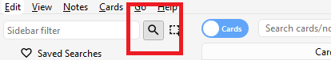
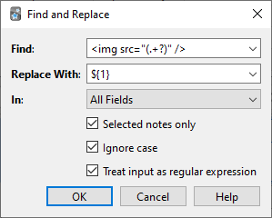

# Browsing

<!-- toc -->

The Browse window allows you to search through your cards and notes, and edit
them. It is opened by clicking **Browse** in the main window, or by pressing
<kbd>B</kbd>. It is comprised of three sections: the _sidebar_ on the
left, the _card/note table_ on the top right, and the _editing area_ on the bottom
right. By positioning the mouse between two sections, it is possible to click
and drag to expand one section and shrink the other.

## Table Modes

Anki 2.1.45+ offers two modes: either cards or notes are shown in the data table.
You can change the current mode by clicking the switch at the top, to the left
of the search area, or pressing <kbd>Ctrl</kbd>+<kbd>Alt</kbd>+<kbd>T</kbd> or
<kbd>Cmd</kbd>+<kbd>Opt</kbd>+<kbd>T</kbd>. The switch also indicates if **C**ards
or **N**otes are currently shown.

**Note**: For the sake of simplicity, this manual generally assumes the Cards
mode to be the active one. Whenever selecting/finding/etc. "cards" is mentioned,
the reader may substitute it for "cards or notes depending on the active mode".

## Sidebar

The _sidebar_ on the left allows quick access to common search terms. On Anki
2.1.45+, it also provides a searchbar, facilities to edit tags and decks, and a
choice of two different tools, which are discussed in the following sections.
You can switch tools using the toolbar at the top of the sidebar or the shortcuts
<kbd>Alt</kbd>+<kbd>1</kbd>/<kbd>2</kbd>.

### Search Tool

With this tool, the sidebar behaves as in previous versions: Clicking on an item
will search for it.

You can hold down <kbd>Ctrl</kbd> (<kbd>Command</kbd> on Mac) while clicking in
order to append the clicked item to the current search with an AND condition,
instead of starting a new search. If you wanted to show _learning_ cards that were
also in the German deck for instance, you could click on "Learning",
then <kbd>Ctrl</kbd>-click on "German".

You can hold down <kbd>Shift</kbd> to create an OR search instead of an AND. For
example, you could click one deck, then <kbd>Shift</kbd>-click another to show
cards from either of the decks in the same view.

You can hold down <kbd>Alt</kbd> (<kbd>Option</kbd> on Mac) in order to reverse the
search (prepend a `-`): for example, to show all cards in a current deck that
do _not_ have a certain tag. <kbd>Alt</kbd>/<kbd>Option</kbd> can be combined with
either <kbd>Ctrl</kbd> or <kbd>Shift</kbd> (e.g. clicking with <kbd>Ctrl</kbd>+<kbd>Alt</kbd>
will result in adding a new search term that is negated).

On Anki 2.1.39+, you can also hold down both <kbd>Ctrl</kbd> and
<kbd>Shift</kbd> together when clicking a search term to replace all occurrences of the
same kind of search with the new one.
Let's say you had previously typed in a complicated search expression like
`deck:Swahili (is:due or tag:important)`
and now want to perform the same search for your Urdu deck. You can hold down
<kbd>Ctrl</kbd>+<kbd>Shift</kbd> while clicking the Urdu deck in the sidebar to obtain the
following search expression:
`deck:Urdu (is:due or tag:important)`.

### Selection Tool

The Selection tool allows for selecting multiple items at the same time by holding down <kbd>Ctrl</kbd>
or <kbd>Shift</kbd> while clicking. It also enables drag-and-drop to reorder decks and
tags.

Here is an example: Say you have the tags `Math`, `Calculus`, and `Algebra`.
Click on the `Calculus` tag, then <kbd>Ctrl</kbd>-click on the `Algebra` tag. Now both
tags are selected, click and drag any of the two onto the `Math` tag to make them
both children of this tag. Behind the scene, Anki has renamed the two tags to
`Math::Calculus` and `Math::Algebra` respectively and updated your notes accordingly.

Another use case for selecting multiple items is searching: If you right-click on
a selection of items, you can choose **Search &gt; All/Any Selected**. This
can be combined with keyboard modifiers as described in [Search Tool](#search-tool)
to append the resulting search to the current search.

### Saved Searches

If you regularly search for the same thing,
you can save the current search by right-clicking the topmost item in the sidebar,
choosing “Save Current Search” and typing in a name.
You can also drag and drop any sidebar item onto this area to add an equivalent
saved search, effectively pinning it at the top.

### Editing Items

You can delete or rename tags, decks, and saved searches directly from the sidebar,
from the right-click menu, or by using a shortcut key (<kbd>Del</kbd> and
<kbd>F2</kbd> on Windows). Deletion even works for multiple items at once
(see [Selection Tool](#selection-tool)).

### Finding Items

To find a certain item in the sidebar tree, type part of its name into the searchbar
at the top to temporarily hide all items not matching the search.

## Search Box

Above the card list is a search box. You can type in various things
there to search for cards. For information on the search syntax,
see [Searching](searching.md).

## Card/Note Table

The table's rows represent cards or notes that match the current search.
When you click on a row, the corresponding note will be shown in the bottom section.

### Rows

If you drag the mouse or hold <kbd>Ctrl</kbd> or <kbd>Command</kbd> to select multiple
rows, the editor will be temporarily hidden. Various operations (such as
changing the deck) can operate on multiple cards or notes at once, independent
of the active mode. Therefore in Cards mode, a note is considered to be selected
if any of its cards is selected, and in Notes mode, a card is considered to be selected
if its note is selected.

Other operations (like showing card information) only operate on a single card
or note. This is called the _current_ card or note, which is usually the one that
was last selected or clicked.
In Cards Mode, again, the current note is the note of the current card and in Notes
mode, the current card is the first card of the current note.

The background colour will change depending on the card and note. In Cards mode,
the first match will be used:

1. if the card is **flagged**, use the flag colour,
2. if the card is **suspended**, yellow,
3. if the card's note is **marked**, purple.

In Notes mode, colour is only applied to marked notes.\
For more information about marked notes and suspended cards, see [Editing and More](studying.md#editing-and-more).

### Columns

The columns are configurable: right click on one (or <kbd>Ctrl</kbd>-click on a
Mac) to choose which columns you'd like to see.
You can drag columns to reorder them. Clicking on a column will sort by that column;
click again to reverse the sort order. Note that you cannot sort by the Question
and Answer columns.

All columns are available for both [Cards and Notes mode](#table-modes)
but sometimes with slightly different names and data. The following table lists
the behaviours for both modes.

<!-- prettier-ignore -->

| Column          | Cards mode                                                                                                                                                                                                                             | Notes mode                                                                                                                                                                                                     |
| --------------- | -------------------------------------------------------------------------------------------------------------------------------------------------------------------------------------------------------------------------------------- | -------------------------------------------------------------------------------------------------------------------------------------------------------------------------------------------------------------- |
| Answer          | The back side of the card in one line with the question stripped. You can also choose a [custom format](templates/styling.md#browser-appearance) in the card type editor instead.                                                      | The same as in Cards mode, only for the first card of the note.                                                                                                                                                |
| Card(s)         | The name of the card's template.                                                                                                                                                                                                       | The number of cards the note has.                                                                                                                                                                              |
| Card Modified   | The last time changes were made to the card (e.g. when you reviewed the card and the review history and interval were updated).                                                                                                        | The last time changes were made to one of the note's cards.                                                                                                                                                    |
| Created         | The same as in Notes mode for the card's note.                                                                                                                                                                                         | The date the note was created.                                                                                                                                                                                 |
| Deck            | The name of the deck the card is in.                                                                                                                                                                                                   | The number of different decks the note's cards are in, or the deck name if all cards are in the same deck.                                                                                                     |
| Due             | The due date for cards in review or (re)learning, and the position in the new card queue for new cards. The line is wrapped in brackets if the card is suspended or buried. Sorting is done by type and only then by date or position. | The due date for the note's next due review or (re)learning card that is not suspended, buried or in a filtered deck.                                                                                          |
| (Avg.) Ease     | The card's ease if it is not new.                                                                                                                                                                                                      | The average ease for the note's cards that are not new.                                                                                                                                                        |
| (Avg.) Interval | The card's interval if the card is in review or relearning.                                                                                                                                                                            | The average interval for the note's cards that are in review or relearning.                                                                                                                                    |
| Lapses          | How often the card was rated “Again”.                                                                                                                                                                                                  | The total lapses for all cards of the note.                                                                                                                                                                    |
| Note            | The same as in Notes mode for the card's note.                                                                                                                                                                                         | The name of the note's notetype.                                                                                                                                                                               |
| Note Modified   | The same as in Notes mode for the card's note.                                                                                                                                                                                         | The last time the note (e.g. the content of a field) was edited.                                                                                                                                               |
| Question        | The front side of the card in one line. You can also choose a [custom format](templates/styling.md#browser-appearance) in the card type editor instead.                                                                                | The same as in Cards mode, only for the first card of the note.                                                                                                                                                |
| Reviews         | How often the card has been reviewed.                                                                                                                                                                                                  | The total review count for all cards of the note.                                                                                                                                                              |
| Sort Field      | The same as in Notes mode for the card's note.                                                                                                                                                                                         | The content of the note's field that is defined as the notetype's sort field. Only this one field can be displayed and sorted by. You can change the sort field by clicking **Fields...** in the editing area. |
| Tags            | The same as in Notes mode for the card's note.                                                                                                                                                                                         | The note's tags.                                                                                                                                                                                               |

## Editing Area

The bottom right area displays the note of the currently selected row. For
more information about cards and notes, see [Getting Started](getting-started.md).
For more information on formatting buttons, see [Editing](editing.md).

You can see a preview of what the currently selected card would look
like when reviewing by clicking the **Preview** button at the top of the editing area.
Note that this will not display any type-the-answer fields on your
cards, which makes it easier to preview the cards quickly.
In Notes mode, the preview is shown for the first card of the selected note.

## Menus and Actions

At the top of the browser window, you find a toolbar with various menus which in
turn offer various actions that can be performed in the browser.

### Edit

<!-- prettier-ignore -->

| Name                 | Action                                                                                                                                                                                                                        |
| -------------------- | ----------------------------------------------------------------------------------------------------------------------------------------------------------------------------------------------------------------------------- |
| Undo                 | Revert the most recently performed operation.                                                                                                                                                                                 |
| Select All           | Select all rows displayed.                                                                                                                                                                                                    |
| Select Notes         | Show only the currently selected notes and select all rows.                                                                                                                                                                   |
| Invert Selection     | Select those rows not selected, and deselect the currently selected rows.                                                                                                                                                     |
| Create Filtered Deck | Show the [filtered deck](filtered-decks.md#creating-manually) dialog and set the current browser search as a filter. Use <kbd>Alt</kbd> / <kbd>Option</kbd> to set the second filter instead (requires scheduler version 2+). |

### Notes

Most of the following actions operate on the selected notes. They are also available through
a context menu when a selected row is right-clicked in Notes mode. In Cards mode,
they can be found in a submenu of the context menu.

<!-- prettier-ignore -->

| Name              | Action                                                                                                                                                                                                                                                                                                                                                     |
| ----------------- | ---------------------------------------------------------------------------------------------------------------------------------------------------------------------------------------------------------------------------------------------------------------------------------------------------------------------------------------------------------- |
| Add Notes         | Open the [Add](editing.md#adding-cards-and-notes) dialog.                                                                                                                                                                                                                                                                                                  |
| Create Copy       | Open a [duplicate](browsing.md#finding-duplicates) of the current note in the [editor](editing.md#adding-cards-and-notes), which can be slightly modified to easily obtain variations of your cards. By default, the duplicate card will be created in the same deck as the original.                                                                      |
| Export Notes      | Open the [Export](exporting.md) dialog.                                                                                                                                                                                                                                                                                                                    |
| Add Tags          | Add provided tags to all selected notes.                                                                                                                                                                                                                                                                                                                   |
| Remove Tags       | Enter tags and remove them from all selected notes.                                                                                                                                                                                                                                                                                                        |
| Clear Unused Tags | Remove all tags from the sidebar that are not used by any notes.                                                                                                                                                                                                                                                                                           |
| Toggle Mark       | If the current note is marked (i.e., has the _Marked_ tag), unmark all selected notes. If the current is not marked, mark all selected notes.                                                                                                                                                                                                              |
| Change Note Type   | Convert the selected notes from one type to another. For example, imagine you have a _Russian_ notetype and a _Computer_ notetype, and you accidentally added some computer-related text into a _Russian_ note. You can use this option to fix that mistake. The scheduling of cards is not affected. Changing the type of a note requires a one-way sync. |
| Find Duplicates   | Open the [Duplicates](#finding-duplicates) dialog.                                                                                                                                                                                                                                                                                                         |
| Find and Replace  | Open the [Find and Replace](#find-and-replace) dialog.                                                                                                                                                                                                                                                                                                     |
| Manage Note Types  | Open the [Notetypes](editing.md#adding-a-note-type) dialog.                                                                                                                                                                                                                                                                                                |
| Delete            | Delete all selected notes and their cards. It is not possible to remove individual cards, as individual cards are controlled by the [templates](templates/intro.md).                                                                                                                                                                                       |

### Cards

The following actions operate on the currently selected cards. They are also available through
a context menu when a selected row is rightclicked in Cards mode. In Notes mode,
they can be found in a submenu of the context menu.

<!-- prettier-ignore -->

| Name           | Action                                                                                                                                                                                                                                                                                                                                                                                                                                                                                                                                                                                                                                                                                                                                                                                                                                                                                                                                                                                                                                                                                               |
| -------------- | ---------------------------------------------------------------------------------------------------------------------------------------------------------------------------------------------------------------------------------------------------------------------------------------------------------------------------------------------------------------------------------------------------------------------------------------------------------------------------------------------------------------------------------------------------------------------------------------------------------------------------------------------------------------------------------------------------------------------------------------------------------------------------------------------------------------------------------------------------------------------------------------------------------------------------------------------------------------------------------------------------------------------------------------------------------------------------------------------------- |
| Change Deck    | Move currently selected cards to a different deck.                                                                                                                                                                                                                                                                                                                                                                                                                                                                                                                                                                                                                                                                                                                                                                                                                                                                                                                                                                                                                                                   |
| Set Due Date   | Turn cards into review cards, and make them due on a certain date. This can be useful for moving cards forward or back a few days when your study schedule is interrupted. Entering a range like `60-90` will make the selected cards due between 60 and 90 days from now. New cards will have their interval set to the same delay, but reviews will be rescheduled without changing their current interval, unless '!' is included at the end of the range. (Note that answer time is not recorded when manually scheduling cards, since the action can be performed even outside of review, and Anki isn’t aware of which card may or may not be shown at the time.)                                                                                                                                                                                                                                                                                                                                                                                                                              |
| Forget         | Move currently selected cards to the end of the new queue. The existing review history is preserved. In 2.1.50+, there are options to restore the original card position, and to reset the card's lapse and repetition counters.                                                                                                                                                                                                                                                                                                                                                                                                                                                                                                                                                                                                                                                                                                                                                                                                                                                                     |
| Reposition     | Change the order new cards will appear in. You can find out the existing positions by enabling the _due_ column, as described in the [table](#cardnote-table) section above. If you run the reposition command when multiple cards are selected, it will apply increasing numbers to each card in turn. By default the number increases by one for each card, but this can be adjusted by changing the "step" setting. The **Shift position of existing cards** option allows you to insert cards between currently existing ones, pushing the currently existing ones apart. For instance, if you have five cards and you want to move 3, 4, and 5 between 1 and 2, selecting this setting would cause the cards to end up in the order 1, 3, 4, 5, 2. By contrast, if you turn this option off, 1 and 2 will get the same position number (and it will thus be unpredictable which of the cards with the same number comes up first). Please note that when enabled, any card with a higher position will be modified, and all of those changed cards will need to be sent the next time you sync. |
| Toggle Suspend | [Suspend](studying.md#editing-and-more) or unsuspend all selected cards, depending on whether the current card is suspended or not.                                                                                                                                                                                                                                                                                                                                                                                                                                                                                                                                                                                                                                                                                                                                                                                                                                                                                                                                                                  |
| Flag           | Toggle the flags of all selected cards. Whether a flag is added or removed depends on whether the current card has the chosen flag.                                                                                                                                                                                                                                                                                                                                                                                                                                                                                                                                                                                                                                                                                                                                                                                                                                                                                                                                                                  |
| Info           | Show various information about the current card, including its review history. For more information, see [Card Info](stats.md#card-info).                                                                                                                                                                                                                                                                                                                                                                                                                                                                                                                                                                                                                                                                                                                                                                                                                                                                                                                                                            |

### Go

This menu exists to provide keyboard shortcuts to jump to various
parts of the browser, and to go up and down the card list.

## Find and Replace

This dialog allows for replacing text on notes. As described above, it is available
from the toolbar and the table's context menu.

The first input field is for the text that is going to be replaced, the second
one for the replacement. Next, there is a dropdown menu that allows you to specify
where Anki should look for text to replace: in a note's tags (requires Anki 2.1.45+),
in all fields, or just in a specific field (only fields belonging to a selected
note will be listed).

By default, only selected notes will be affected. If you want to lift that
restriction, you can untick the "selected notes only" checkbox (requires Anki 2.1.45+).

The regular expression option allows you to perform complex replacements.
For example, assume there is the following text in a field:

    

We use these settings:

(Note that on Anki versions prior to 2.1.28, you would need to replace `${1}`
with `\1`.)

Then the assumed field content will change to:

    pic.jpg

A full discussion on regular expressions is outside the scope of this document.
There are a number of syntax guides available on the web:

- For Anki 2.1.28+, see <https://docs.rs/regex/latest/regex/index.html#syntax>.
- For older Anki versions, see <http://docs.python.org/library/re.html>.

## Finding Duplicates

You can use the **Notes > Find Duplicates** option to search for notes that
have the same content. When you open the window, Anki will look at all
of your note types and present a list of all possible fields. If you
want to look for duplicates in the _Back_ field, you’d select it from
the list and then click **Search**.

By default, it will search in all note types that have the field you provided.
This differs from the duplicate check when you add cards manually, which
is limited to a single note type.

The **Optional filter** text box allows you to narrow down where Anki will
look for duplicates. If you only want to search for duplicates in the
"French Vocab" and "French Verbs" note types, you would enter:

    "note:french vocab" or "note:french verbs"

Or you might want to look only for duplicates in a particular deck, so
you could use:

    "deck:myDeck"

The search syntax is the same as used when searching in the browser.
For more information, see [Searching](searching.md).

You can click one of the links in the search results list to display the
duplicate notes in that set. If the search brings up a large number of
duplicates, you may wish to instead click the **Tag Duplicates** button,
which will tag all matching notes with _duplicate_. You can then search
for this tag in the browser and handle them all from the same screen.
