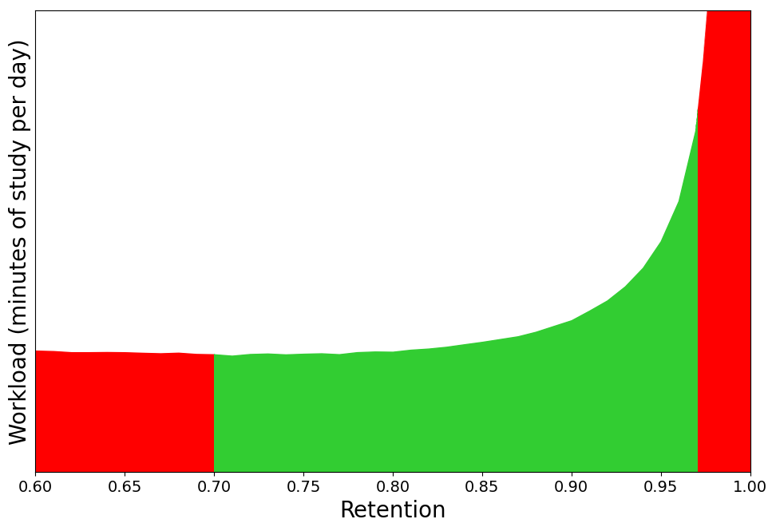

# Deck Options

<!-- toc -->

Deck options primarily control the way Anki schedules cards. It is recommended
that you spend a few weeks with the defaults to get a feel for how Anki works
before you start adjusting options. Please make sure you understand the options
before changing them, as mistakes could reduce Anki's effectiveness.

Deck options are accessed by:

- Clicking the gear icon on the `Decks` screen.
- Selecting a deck on the `Decks` screen, and then clicking `Options`
  at the bottom of the screen.
- Clicking on `More` > `Options` while in review mode.
- Pressing `o` while in review mode.

This page describes the options shown in Anki 2.1.45+, when you have the v2 or
v3 scheduler enabled. On older versions, some options will not be available, or
will appear in a different section. Please keep in mind that the v1 scheduler
is no longer supported in Anki 2.1.50+. If you have not yet updated to v2 or v3,
you will be prompted to update when you attempt to review cards in 2.1.50+.

For more info on deck options, please check:

- [Deck Options Explained](https://forums.ankiweb.net/t/deck-options-explained/213)
- [Deck Options in a Mental Map](https://forums.ankiweb.net/t/deck-options-in-a-mental-map/15757)

## Presets

Anki allows you to share options between different decks, to make
it easy to update options in many decks at once. To do this, options are
grouped into _presets_. By default, all newly created decks use
the same preset.

If you’d like to alter the settings on one deck but not other decks, click the
arrow icon in the top right of the Deck Options window. The options are:

- **Save**: Saves all modifications you've made since opening the deck options screen.
- **Add**: Add a new preset, with the default options.
- **Clone**: Clone your current present, which is useful if you
  just want to modify certain options, keeping the rest as they are.
- **Rename** Changes the name of the current preset.
- **Delete** Deletes the current preset. This will require that the next sync is
  a one-way sync.
- **Save to all subdecks**. Like _Save_, but also assigns the selected preset to all
  subdecks of the currently selected deck.

Deck Options are not retroactive. For example, if you change an option that
controls the delay after failing a card, cards that you failed prior to
changing the option will have the old delay, not the new one.

## Subdecks

If your deck has subdecks, each deck can optionally be assigned a different preset.
When Anki shows a card, it will check which subdeck the card is in, and use the options
for that deck. There are some exceptions:

- The new cards/day and reviews/day [limits](#daily-limits) behave differently
  depending on the scheduler version you have selected.
- The [display order](#display-order) options in the v3 scheduler are taken from the
  deck you select to study, not the deck of the current card.

For example, let's say you have this collection:

    - Deck A (Preset 1)
      - Deck A::Subdeck B (Preset 2)
        - Card B1
        - Card B2

Preset 1 and 2 are identical, with two exceptions:

- Preset 1:
- New Cards - Learning steps: 1m 10m
- Display Order - New/review priority: Mix with reviews
- Preset 2:
- New Cards - Learning steps: 20m 2h
- Display Order - New/review priority: Show after reviews

If you choose to study Deck A:

- Learning steps for all new cards will be 1m 10m (preset 1 applies)
- All new cards will be mixed with reviews (preset 1 applies)

If you choose to study Subdeck B:

- Learning steps for all new cards will be 20m 2h (preset 2 applies)
- All new cards will be shown after reviews (preset 2 applies)

## Daily Limits

### New Cards/Day

Controls how many new cards are introduced each day you open the program. If you
study fewer than the limit, or miss a day, the next day the counts will be back
to your limit - they do not accumulate.

When decks are nested (e.g Parent, Parent::Child, Parent::Child::Grandchild),
the way the limits are applied depends on the scheduler version.

- v1 applies parent limits to children, regardless of which deck you click on
- v2 behaves similarly to v1 for new cards. For reviews, only the limits of
  the deck you click on are honored.
- v3 honors the limits of the deck you click on, and any decks inside it.
  Limits from parents above the deck you clicked on are ignored.

For more information, please see the [v3 scheduler](https://faqs.ankiweb.net/the-2021-scheduler.html#daily-limits) page.

Studying new cards will temporarily increase the number of reviews you need to
do a day, as freshly learnt material needs to be repeated a number of times
before the delay between repetitions can increase appreciably. If you are
consistently learning 20 new cards a day, you can expect your daily reviews to
be roughly about 200 cards/day. You can decrease the reviews required by
introducing fewer new cards each day, or by turning off new card display until
your review burden decreases. More than one Anki user has excitedly studied
hundreds of new cards over their first few days of using the program, and then
become overwhelmed by the reviews required.

### Maximum Reviews/Day

Allows you to set an upper limit on the number of reviews to show each day.
When this limit is reached, Anki will not show any more review cards for the
day, even if there are some waiting. If you study consistently, this setting can
help to smooth out occasional peaks in due card counts, and can save you from a
heart attack when returning to Anki after a week off. When reviews have been
hidden due to this option, a message will appear in the congratulations screen,
suggesting you consider increasing the limit if you have time.

In [the v3 scheduler](https://faqs.ankiweb.net/the-2021-scheduler.html#daily-limits) and
v1 schedulers, the counts are affected by parents/selected decks in the same way
as new cards.

In the v2 scheduler, the limit is taken solely from the deck you select - any
limits on its parents or child decks are ignored.

The v3 scheduler includes learning cards with a 1+ day delay in the review count,
so those learning cards will be subject to the daily limit.

### New Cards Ignore Review Limit

If using [the v3 scheduler](https://faqs.ankiweb.net/the-2021-scheduler.html#daily-limits),
please keep in mind that the new count is capped by the review count by default. If your
review limit is set to 200, and you have 190 reviews waiting, a maximum of 10
new cards will be introduced. If your review limit has been reached, no new
cards will be shown. If you have a backlog of reviews and still want to
introduce new cards, you can do so by suspending the reviews, or increasing your
review limit. That said, it is recommended you hold off on new cards until you
catch up instead, as introducing more new cards when you're behind will only
make the backlog worse.

From Anki 2.1.61 this feature is optional, and can be deactivated globally from the
deck options screen.

### Per-Deck Daily Limits

From version 2.1.55 it is possible to use the same preset for different decks / subdecks, with customized
limits for each one of them. This eliminates the need to create cloned presets just for that
purpose, and makes it easier to set custom limits on sub-decks when you have many nested decks.

The options are:

- Preset: The limit is shared with all decks using this preset.
- This deck: The limit is specific to this deck.
- Today only: Make a temporary change to this deck's limit.

## New Cards

The settings in this section only affect new cards and cards in initial
[learning](studying.md#learningrelearning-cards) mode. Once a card
has graduated (i.e. there are no more learning steps for this card), it becomes a
[review card](studying.md#review-cards), and the
settings in this section are no longer applicable.

### Learning Steps

Controls the number of learning repetitions, and the delay
between them. One or more delays, separated by spaces must be entered.
Each time you press `Good` during review, the card moves to the next step.

For example, let's say that your learning steps are **1m 10m 1d**.

- When you press `Again`, the card goes back to first step, and will be shown
  again approximately 1 minute later.
- When you press `Good` on a new card, or a card answered `Again`, it will move
  to the next step, and be shown again in approximately 10 minutes.
- When you press `Good` on a card after the 10 minute step, it will be delayed
  until the next day.
- When you press `Good` on the card the next day, it will leave learning (i.e. it will graduate), and
  become a review card. It will be shown again after the delay configured by the
  _graduating interval_.

If there’s nothing else to study, Anki will show cards up to 20 minutes
early by default. The amount of time to look ahead is configurable in
the [preferences](preferences.md).

Please see the [learning](studying.md#learningrelearning-cards) section for more info on how
steps work.

#### Day Boundaries

Anki treats small steps and steps that [cross a day boundary](./preferences.md#review) differently.
With small steps, the cards are shown as soon as the delay has passed,
in preference to other waiting cards like reviews. This is done so that
you can answer the card as closely to your requested delay as possible.
In contrast, if the interval crosses a day boundary, it is automatically
converted to days.

### Graduating Interval

The delay in days between answering "Good" on a learning card with no steps left,
and seeing the card again as a review card. This means that it is the first interval
after the learning card becomes a review card. Please see the example
in the previous section.

### Easy Interval

The delay between answering `Easy` on a learning
card, and seeing it in review mode for the first time.

The `Easy` button immediately turns a learning card into a review card,
and assigns it the delay you have configured. It should always be at least
as long as the _graduating interval_, and typically a few days longer.

### Insertion Order

Controls whether Anki should add new cards into the deck randomly, or in order.
When you change this option, Anki will re-sort the decks using the current
Option Group. Cards with a lower due number will be shown first when studying, by
default. Changing this option will automatically update the existing position of
new cards.

One caveat with random order mode: if you review many of your new cards, and then
add more new cards, the newly added material is statistically more likely to
appear than the new cards that were already in the deck. For example, if you have 100 cards
in random order, then review the first 50, newly added cards are still given
position 1-100, but as you have already reviewed the first 50, the newly added
cards are more likely to appear earlier. To correct this, you can change the
order to Ordered mode and back again to force a re-sort.

When you select random order, Anki will randomize your notes, keeping
the cards of a given note close together. The cards of a given note are
shown in the order in which their card types appear, so that siblings are
introduced consistently — otherwise you could end up in a state where
some notes had all their cards introduced and other notes had only one
or two. Please see the "bury related" and "display order" sections below
for more info.

## Lapses

When you forget a review card, it is said to have 'lapsed', and the card must be
relearnt. The default behaviour for lapsed reviews is to reset the interval to
1 (i.e. make it due tomorrow), and put it in the learning queue for a refresher
in 10 minutes. This behaviour can be customized with the options listed below.

### Relearning Steps

The same as 'learning steps', but for forgotten reviews. When you fail a card
(press `Again`), the card enters the relearning phase, and before it becomes a
review card again, you will have to pass all the relearning steps — or, alternatively, press
`Easy` on the card.

If you leave the steps blank, the card will skip relearning, and will be assigned
a new review delay.

### Minimum Interval

Specifies a minimum number of days a card should wait after it finishes relearning.
The default is one day, meaning once relearning is finished, it will be shown again
the next day.

### Leeches

Control the way Anki handles leeches. Please see the [leeches](leeches.md)
section for more information.

## Display Order

The options in this section are taken from the deck you select to study, not
the deck of the currently displayed card.

This section is only available when you have [the v3 scheduler](https://faqs.ankiweb.net/the-2021-scheduler.html) enabled.

Some further information about display order is available in the [studying section](studying.md#display-order).

### New Card Gather Order

Controls how Anki gathers cards from each subdeck. The options are:

- Deck: gathers cards from each deck in order, starting from the top. Cards from
  each deck are gathered in ascending position. If the daily limit of the selected
  deck is reached, gathering may stop before all decks have been checked. This
  order is fastest in large collections, and allows you to prioritize subdecks that
  are closer to the top.

  Decks / subdecks are always ordered alphabetically, so you can give them a numeric prefix like
  001 to control the order they are shown. You can also use `_` and `~` as a
  prefix to place items at the top or bottom.

  Although position order depends initially on the 'Insertion Order' setting
  above, you can manually
  [reposition](https://docs.ankiweb.net/browsing.html#cards) cards in different
  ways.

- Deck, then random notes: gathers cards from each deck in order, starting from the top.
  Cards from each deck are gathered randomly.

- Ascending position: gathers cards by ascending position (due #), which is typically the oldest-added first.

- Descending position: gathers cards by descending position (due #), which is typically the latest-added first.

- Random notes: gathers cards of randomly selected notes. When sibling burying is disabled, this allows all cards of a note to be seen in a session (eg. both a front->back and back->front card)

- Random cards: gathers cards completely randomly.

### New Card Sort Order

Controls how new cards are sorted **after they have been gathered**. The options are:

- Card type: Displays cards in order of card type number. If you have sibling burying disabled, this will ensure all front→back cards are seen before any back→front cards. This is useful to have all cards of the same note shown in the same session, but not too close to one another.

- Order gathered: Shows cards exactly as they were gathered. If sibling burying is disabled, this will typically result in all cards of a note being seen one after the other.

- Card type, then random: Like Card type, but shuffles the cards of each card type number. If you use Ascending position to gather the oldest cards, you could use this setting to see those cards in a random order, but still ensure cards of the same note do not end up too close to one another.

- Random note, then card type: Picks notes at random, then shows all of their siblings in order.

- Random: Fully shuffles the gathered cards.

### New/Review Priority

Whether new cards should be mixed in with reviews, or shown before or after them.

### Interday Learning/Review Priority

Whether learning cards with a 1+ day delay should be mixed in with reviews, or
shown before or after them. Because learning cards tend to be harder than
reviews, some users prefer to see them at the end (getting the easy stuff done
first), or at the start (allowing more time to review forgotten ones).

### Review Sort Order

Controls how review cards are sorted while reviewing. The options are:

- Due date, then random: The default option prioritizes cards that have been waiting
  longer, and it's the recomended option when you are up to date, or when you only have a small
  backlog. If you have taken an extended break or have fallen behind in your reviews,
  you may want to consider changing the sort order temporarily.
- Due date, then deck. This also prioritizes cards that have been waiting
  longer, and then will show reviews for each subdeck in turn.
- Deck, then due date: This option will ensure reviews are shown for each
  subdeck in turn. This is generally not recommended, as having material appear
  consistently in the same order makes it easier to guess the answer based on context,
  and may lead to weaker memories.
- Ascending intervals: This will ensure cards with shorter intervals are shown first.
- Descending intervals: This will ensure cards with larger intervals are shown first.
- Ascending ease: This will show most difficult cards first.
- Descending ease: This will allow you to work through the easier material first.
- Relative overdueness: Display cards that you're most likely to have forgotten first. This is useful if
  you have a large backlog that may take some time to get through, and you want to
  reduce the chances of forgetting more cards.

  When using the SM-2 scheduler, overdueness is determined by comparing how
  overdue cards are, and how long their interval is. For example, a card with a
  current interval of 5 days that is overdue by 2 days, will display before a card
  with a current interval of 10 days that is overdue by 3 days.

  When using FSRS, overdueness is calculated based on on each card's retrievability,
  and the desired retention in the deck preset.

## Timer

Anki monitors how long it takes you to answer each card, so that it
can show you how long was spent studying each day. The time taken does
not influence scheduling.

The options are:

- Maximum answer seconds: The default limit is 60 seconds. If you take
  longer than that, Anki assumes you have walked away from your computer
  or have been distracted, and limits the recorded time to 60 seconds, so
  that you don’t end up with inaccurate statistics. If you consistently
  take longer than 60 seconds to answer a card (from when question is shown
  until you press an answer button), you may want to either consider raising
  this limit, or, ideally, making your cards simpler.
- Show answer timer: In the review screen, show a timer that counts the number
  of seconds you're taking to review each card.
- Stop timer on answer: whether the timer should keep running when you show
  the answer.

## Auto Advance

Requires Anki 23.12 or later. Auto Advance allows you to automatically reveal
the answer and/or move to the next card. To use it, you must first set a non-zero
time in "seconds to show question" and/or "seconds to show answer". Then, in the
review screen, use the Auto Advance action from the `More` button to start advancing.

## Burying

When Anki gathers cards, it first gathers intraday learning cards, then interday learning cards, then reviews, and finally new cards. This affects how burying works:

- If you have all burying options enabled, the sibling that comes earliest in that list will be shown. For example, a review card will be shown in preference to a new card.
- Siblings later in the list can not bury earlier card types. For example, if you disable burying of new cards, and study a new card, it will not bury any interday learning or review cards, and you may see both a review sibling and new sibling in the same session.

The options are:

- Bury new siblings: whether other new cards of the same note (e.g., reverse cards, adjacent cloze deletions) will be delayed until the next day.
- Bury review siblings: whether other review cards of the same note will be delayed until the next day.
- Bury interday learning siblings: whether other learning cards of the same note with intervals >= 1 day will be delayed until the next day.

For more info about burying cards, please see [this section](./studying.md#siblings-and-burying) of the manual.

## Audio

By default, Anki automatically plays audio on the front and back of
cards. If you check _Don't play audio automatically_, Anki will not play
audio until you press the replay audio key, `r` or `F5`.

_Always include question side when replaying audio_ controls whether audio from
the question side should be played when replaying the audio while an answer is
shown. Please note that it does not control what happens when you show the
answer; for that please see [this section](templates/fields.md#special-fields).

## Advanced

### FSRS

The [Free Spaced Repetition Scheduler (FSRS)](https://github.com/open-spaced-repetition/fsrs4anki) is an alternative to Anki's legacy
SuperMemo 2 (SM2) scheduler. By more accurately determining when you are likely
to forget, it can help you remember more material in the same amount of time.
This setting is shared by all deck presets.

FSRS is currently in the advanced section, as it was only just integrated into
Anki in the 23.10 release. When you enable the setting, some new options will
become available, and SM-2 specific settings, such as "Graduating interval",
"Easy bonus", etc, will be hidden.

**Before Enabling**

- Please ensure all of your Anki clients support FSRS. Anki 23.10, AnkiMobile 23.10,
  and AnkiWeb all support it. AnkiDroid supports it in 2.17alpha3+. If
  one of your clients doesn't support it, things will not work correctly.
- If you previously used the 'custom scheduling' version of FSRS, please make
  sure you clear out the custom scheduling section before enabling FSRS.

#### FSRS Options

**Desired Retention**

Desired retention controls how likely you are to remember cards when they are reviewed.
The default value of 0.9 will schedule cards so you have a 90% chance of remembering
them when they come up for review again.

Here is a graph that shows how adjusting this value will affect your workload:

There are two things to notice:

- As desired retention approaches 1.0, the frequency that you need to review cards
  increases drastically. For example, imagine you have a card that you have a 90%
  chance of remembering after 100 days. If your desired retention was 0.95, you'd
  need to review it after 47 days instead (approximately twice as frequently).
  At 0.97, the delay would be only 27 days (approximately 3.7x as frequently).
  At 0.99, you'd be reviewing every 9 days (more than 10x what you'd be doing with
  the defaults).

- As desired retention decreases, you'll forget a greater percentage of your
  cards, and those cards will need to be reviewed again. Eventually, you'll
  get to a point where the forgotten cards contribute more to your workload
  than you gain from the longer delays, which is why you see the workload
  on the left of the graph increasing. Also, bear in mind that forgetting
  material frequently is demotivating.

For these reasons, we suggest you be conservative when adjusting this
number, and recommend you keep it between 0.85 and 0.95.

**SM-2 retention**

If your actual retention before switching to FSRS was significantly different
from 0.9, adjusting this value will allow Anki to better estimate your memory
state when it encounters cards that are missing review logs. Since review
logs typically won't be missing unless you explicitly deleted them to free
up space, most users will not need to adjust this.

**FSRS parameters**

FSRS parameters affect how cards are scheduled. They are not intended to be
manually modified. Once you've accumulated 1000+ reviews, you can have Anki
optimize the parameters for you, based on your review history.

**Reschedule cards on change**

This option controls whether the due dates of cards will be changed when you
enable FSRS, or change the parameters. The default is not to reschedule
cards: future reviews will use the new scheduling, but there will be no
immediate change to your workload. If rescheduling is enabled, the due dates
of cards will be changed, often resulting in a large number of cards becoming
due, so **activating this option is not recommended** when first switching from SM2.

If you wish to visualize how FSRS would change your schedule without altering
your workload, there are two ways you can do so:

- Enable FSRS without rescheduling, and compare the interval and stability
  graphs. The interval graph will show the current intervals of cards; the stability
  graph will show the intervals FSRS would give cards if the desired retention is 0.9.
- Create a backup, enable FSRS with rescheduling, check the future due graph, and then
  undo or restore from the backup.

**Optimize FSRS parameters**

The FSRS optimizer uses machine learning to learn your memory patterns
and find parameters that best fit your review history. To do this, the optimizer
requires several reviews to fine-tune the parameters.

If you have less than 1,000 reviews, you can use the default parameters that
are already entered into the "FSRS parameters" field. Even with the default
parameters, FSRS should work well for most users.

Once you've done 1000+ reviews in Anki, you can use the `Optimize` button to
analyze your review history, and automatically generate parameters that are
optimal for your memory and the content you're studying. Parameters are
preset-specific, so if you have decks that vary wildly in difficulty, it
is recommended to assign them separate presets, as the parameters for easy
decks and hard decks will be different. There is no need to optimize your
parameters frequently - once every few months is sufficient.

By default, parameters will be calculated from the review history of all
decks using the current preset. You can optionally adjust the search
before calculating the parameters, if you'd like to alter which cards
are used for optimizing the parameters.

**Evaluate FSRS parameters**

You can use the `Evaluate` button in the "Optimize FSRS parameters"
section to see metrics that show how well the parameters in the
"Model parameters" field fit your review history. Smaller numbers
indicate a better fit to your review history.

Log-loss doesn't have an intuitive interpretation. RMSE (bins) can be
interpreted as the average difference between the predicted probability
of recalling a card (R) and the measured (from the review history)
probability. For example, RMSE=5% means that, on average, FSRS
is off by 5% when predicting R.

Note that log-loss and RMSE (bins) are not perfectly correlated,
so two decks may have similar RMSE values but very different log-loss values,
and vice-versa.

**Compute optimal retention**

This experimental tool assumes you're starting with 0 cards, and will
attempt to calculate the amount of material you'll be able to retain
in the given time frame. The estimated retention will greatly depend
on your inputs, and if it significantly differs from 0.9, it's a sign
that the time you've allocated each day is either too low or too high
for the amount of cards you're trying to learn. This number can be
useful as a reference, but it is not recommended to copy it into the
desired retention field.

#### Learning and Re-learning Steps

(Re)learning steps of 1+ days are not recommended when using FSRS. The main 
reason they were popular with the old SM-2 scheduler is because repeatedly 
failing a card after it has graduated from the learning phase could reduce 
its ease a lot, leading to what some people called "ease hell". This is not 
a problem that FSRS suffers from.  By keeping your learning steps under a 
day, you will allow FSRS to schedule cards at times it has calculated are 
optimum for your material and memory.  Another reason not to use longer 
learning steps is because FSRS may end up scheduling the first review for a 
shorter time than your last learning step, leading to the `Hard` button 
showing a longer time than `Good`.

We also recommend you keep the number of learning steps to a minimum. Evidence
shows that repeating a card multiple times in a single day after you've
remembered it does not significantly help with memory, so your time is
better spent on other cards or a shorter study session

#### Add-On Compatibility

Some add-ons can cause conflicts with FSRS. As a general rule of thumb,
if an add-on affects a card's intervals, it shouldn't be used with FSRS.
A list of commonly used add-ons and their FSRS compatibility can be found in [Add-on Compatibility](https://github.com/open-spaced-repetition/fsrs4anki#add-on-compatibility).

#### More

For more info on FSRS, please check:

- [FSRS4Anki Wiki](https://github.com/open-spaced-repetition/fsrs4anki/wiki)
- [FSRS4Anki on Github](https://github.com/open-spaced-repetition/fsrs4anki)

### Maximum Interval

Allows you to place an upper limit on the time Anki
will wait to reshow a card. The default is 100 years; you can decrease
this to a smaller number if you’re willing to trade extra study time for
higher retention.

### Starting Ease

Controls the easiness that cards start out with. It is
set when a card graduates from learning for the first time. It defaults
to 2.50, meaning that once you have finished learning a card, answering
`Good` on subsequent reviews will increase the delay by approximately
2.5x (e.g. if the last delay was 10 days, the next delay would be around 25
days). Based upon how you rate the card in subsequent reviews, the
easiness may increase or decrease from its starting value.

### Easy Bonus

An extra multiplier applied to the interval when a review card is answered
`Easy`. With the default value of 1.30, `Easy` will give an interval that is
1.3 times the `Good` interval (e.g. if the Good interval was 10 days, the Easy
interval would be around 13 days).

### Interval Modifier

An extra multiplier that is applied to all reviews. At its default of 1.00 it
does nothing. If you set it to 0.80, though, for example, intervals will be generated at
80% of their normal size (so a 10 day interval would become 8 days). You can
thus use the multiplier to make Anki present cards more or less frequently than
it would otherwise, trading study time for retention or vice versa.

For moderately difficult material, the average user should find they
remember approximately 90% of mature cards that come up for review. You
can find out your own performance by opening the graphs/statistics for a
deck and looking at the Answer Buttons graph - mature retention is the
correct% on the right side of the graph. If you haven’t been studying
long, you may not have any mature cards yet. As performance with new
cards and younger cards can vary considerably, it’s a good idea to wait
until you have a reasonable amount of mature reviews before you start
drawing conclusions about your retention rate.

On the SuperMemo website, they suggest that you can find an appropriate
multiplier for a desired retention rate. Their formula boils down to:

    log(desired retention%) / log(current retention%)

Imagine we have a current retention rate of 85% and we want to increase
it to 90%. We’d calculate the modifier as:

    log(90%) / log(85%) = 0.65

You can use Google to [calculate it](https://www.google.com/search?q=log(90%25)+%2F+log(85%25)) for you.

If you plug the resulting 65% into the interval modifier, you should
find over time that your retention moves closer to your desired
retention.

One important thing to note however is that the trade-off between time
spent studying and retention is not linear: we can see here that to
increase our retention by 5 percentage points, we would have to study 35%
more frequently. If the material you are learning is very important then
it may be worth the extra effort – that is, of course, something you will need to
decide for yourself. If you are simply worried that you are forgetting too
much, then you may find investing more time at the initial learning stage
and/or using mnemonics will give you more gain for less effort.

One final thing to note is that Anki forces a new interval to be at
least 1 day longer than it was previously, so that you do not get stuck
reviewing with the same interval forever. If your goal is to repeat a
card once a day for multiple days, you can do that by setting more
learning mode steps, instead of by adjusting this modifier.

### Hard Interval

The multiplier used when you use the `Hard` button. The percentage is relative
to the previous interval: e.g. with a default of 1.20, a card with a 10-day interval
will be given 12 days.

### New Interval

The multiplier used when you use the `Again` button on a review card. The
default 0.00 means that a review card's delay is reset to zero when you forget it
(which then becomes 1 day after the [minimum interval](#minimum-interval) is
applied).

If changed from the default, it is possible for forgotten cards to preserve part
of their previous delay. For example, if a card had a 100 day interval, and you set
the _New Interval_ to 0.20, the new interval would be 20 days.

While preserving part of the interval may seem to make sense, SuperMemo has observed
that preserving part of the delay can actually [be counter-productive](https://supermemo.guru/wiki/Post-lapse_stability). For this reason, we recommend you leave it on the default setting.

## Custom Scheduling

Please see [this page](https://faqs.ankiweb.net/the-2021-scheduler.html#add-ons-and-custom-scheduling).
