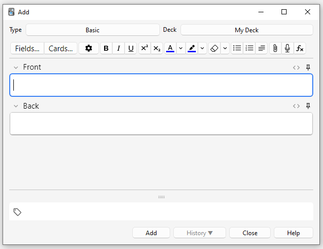
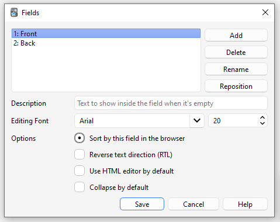
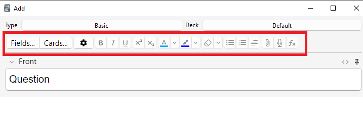
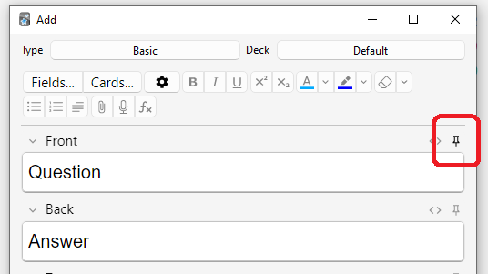
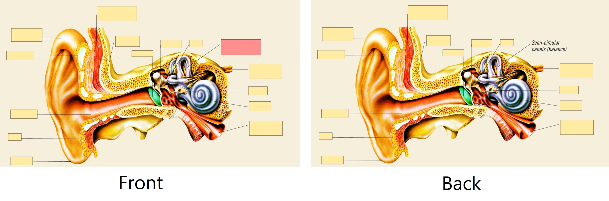
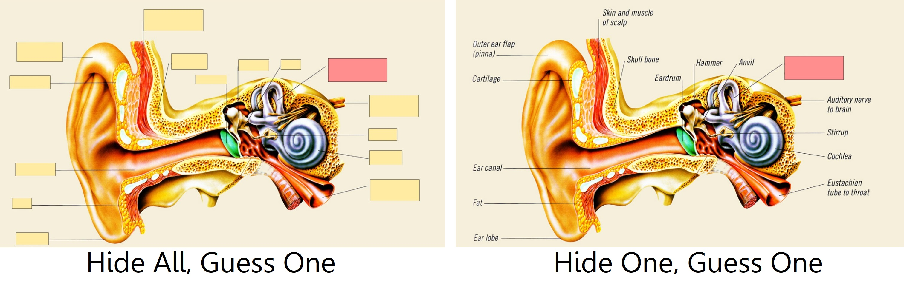

# Adding/Editing

<!-- toc -->

## Adding Cards and Notes

Recall from the [basics](getting-started.md) that in Anki we add notes rather than
cards, and Anki creates cards for us. Click 'Add' in the [main window](studying.md#decks),
and the Add Notes window will appear.



The top left of the window shows us the current [note type](getting-started.md#note-types). If it does
not say "Basic," then you may have added some note types when you
downloaded a shared deck. The text below assumes that "Basic" is
selected.

The top right of the window shows us the [deck](getting-started.md#decks) cards will be added to. If
you would like to add cards to a new deck, you can click on the deck name
button and then click "Add".

Below the note type, you'll see some buttons, and an area labelled
"Front" and "Back". Front and Back are called [fields](getting-started.md#notes--fields), and you can add,
remove, and rename them by clicking the "Fields…​" button above.

Below the fields is another area labelled "**tags**". Tags are labels that
you can attach to your notes, to make organizing and finding notes
easier. You can leave the tags blank if you wish, or add one or more of
them. Tags are separated by a space. If the tags area says

    vocab check_with_tutor

…​then the note you add would have two tags.

When you have entered text into the front and back, you can click the
"Add" button or press <kbd>Ctrl</kbd>+<kbd>Enter</kbd> (<kbd>Command</kbd>+<kbd>Enter</kbd> on a Mac) to add the
note to your collection. When you do so, a card will be created as well,
and placed into the deck you chose. If you would like to edit a card you
added, you can click the history button to search for a recently added
card in the [browser](browsing.md).

For more information on the buttons between the note type and the
fields, please see the [editor](editing.md) section.

### Duplicate Check

Anki checks the first field for uniqueness, so it will warn you if you
enter two cards with a Front field of "apple" (for example). The
uniqueness check is limited to the current note type, so if you're
studying multiple languages, two cards with the same Front would not be
listed as duplicates as long as you had a different note type for each
language.

Anki does not check for duplicates in other fields automatically for
efficiency reasons, but the browser has a "Find Duplicates" function,
which you can run periodically.

### Effective Learning

Different people like to review in different ways, but there are some
general concepts to keep in mind. An excellent introduction is [this article](https://super-memory.com/articles/20rules.htm) on the SuperMemo
site. In particular:

- **Keep it simple**: The shorter your cards, the easier they are to
  review. You may be tempted to include lots of information "just in
  case," but reviews will quickly become painful.

- **Don't memorize without understanding**: If you are studying a
  language, try to avoid large lists of words. The best way to learn
  languages is in context, which means seeing those words used in a
  sentence. Likewise, imagine you're studying a computer course. If
  you attempt to memorize the mountain of acronyms, you'll find it
  very difficult to make progress. But if you take the time to
  understand the concepts behind the acronyms, learning the acronyms
  will become a lot easier.

## Adding a Note Type

While basic note types are sufficient for simple cards with only a word
or phrase on each side, as soon as you find yourself wanting to include
more than one piece of information on the front or back, it's better to
split that information up into more fields.

You may find yourself thinking "but I only want one card, so why can't I
just include the audio, a picture, a hint, and the translation in the
Front field?" If you'd prefer to do that, that's fine. But the
disadvantage of that approach is that all the information is stuck
together. If you wanted to sort your cards by the hint, you wouldn't be
able to do that as it is mixed in with the other content. You also
wouldn't be able to do things such as moving the audio from the front to the
back, except by laboriously copying and pasting it for every note. By
keeping content in separate fields, you make it much easier to adjust
the layout of your cards in the future.

To create a new type of note, choose Tools → Manage Note Types from the
main Anki window. Then click "Add" to add a new type of note. You will now
see another screen that gives you a choice of note types to base the new
type on. "Add" means to base the newly created type on one that comes
with Anki. "Clone" means to base the newly created type on one that is
already in your collection. For instance, if you'd created a French
vocab type already, you might want to clone that when creating a German
vocab type.

After choosing OK, you will be asked to name the new type. The subject
material that you are studying is a good choice here – things like "Japanese",
"Trivia", and so on. Once you have chosen a name, close the Note Types
window, and you will return to the adding window.

## Customizing Fields

To customize fields, click the "Fields…​" button when adding or editing
a note, or while the note type is selected in the Manage Note Types
window.



You can add, remove, or rename fields by clicking the appropriate
buttons. To change the order in which the fields appear in this dialog
and the add notes dialog, you can use the reposition button, which asks
for the numerical position you want the field to have. So if you want to
change a field to be the new first field, enter "1".

Do not use 'Tags', 'Type', 'Deck', 'Card', or 'FrontSide' as field
names, as they are [special fields](templates/fields.md#special-fields) and will not work
properly.

The options at the bottom of the screen allow you to edit various
properties of the fields to be used when adding and editing the cards.
This is _not_ where you customize what appears on your cards when
reviewing; for that, please see [templates](templates/intro.md).

- **Editing Font** allows you to customize the font and size used when
  editing notes. This is useful if you want to make unimportant
  information smaller, or increase the size of foreign characters which
  are hard to read. The changes you make here do not affect how cards
  appear when reviewing: to do that, please see the
  [templates](templates/intro.md) section. If you have enabled the "type in the
  answer" function, however, the text you type will use the font size
  defined here. (For information about how to change the actual font face
  when typing the answer, please see the [checking your answer](templates/fields.md#checking-your-answer) section.)

- **Sort by this field…​** tells Anki to show this field in the Sort Field
  column of the browser. You can use this to sort cards by that field.
  Only one field can be the sort field at once.

- **Reverse text direction** is useful if you are studying languages that
  display text from right to left (RTL), such as Arabic or Hebrew. This
  setting currently only controls editing; to make sure the text displays
  correctly during review, you'll need to adjust your
  [template](templates/styling.md#text-direction).

- **Use HTML editor by default** is useful if you prefer to edit the fields
  directly in HTML.

- **Collapse by default**. Fields can be collapsed/expanded.
  The animation can be disabled in the [preferences.](preferences.md)

- **Exclude from unqualified searches (slower)** can be used if you want
  the content of a certain field not to appear in unqualified [(not limited to a specific field)](searching.md#limiting-to-a-field)
  searches.

After you have added fields, you will probably want to add them to the front
or back of your cards. For more information on that, please see the
[templates](templates/intro.md) section.

## Changing Deck / Note Type

While adding, you can click on the top left button to change note type,
and the top right button to change deck. The window that opens up will
not only allow you to select a deck or note type, but also to add new
decks or manage your note types.

## Organizing Content

### Using Decks Appropriately

[Decks](getting-started.md#decks) are designed to divide your content up into
broad categories that you wish to study separately, such as English, Geography,
and so on. You may be tempted to create lots of little decks to keep your
content organized, such as "my geography book chapter 1", or "food verbs", but
this is not recommended, for the following reasons:

- Lots of little decks may mean you end up seeing cards in a
  recognizable order. On older scheduler versions, new cards can only
  be introduced in deck order. And if you were planning to click on each deck
  in turn (which is slow), you will end up seeing all the "chapter 1" or
  "food verb" reviews together. This makes it easier to answer the
  cards, as you can guess them from the context, which leads to weaker
  memories. When you need to recall the word or phrase outside Anki,
  you won't always have the luxury of being shown related content first!

- While less of a problem than it was in earlier Anki versions,
  adding hundreds of decks may cause slowdowns, and very large deck
  trees with thousands of items can actually break the display of
  the deck list in Anki versions before 2.1.50.

### Using Tags

Instead of creating lots of little decks, it's a better idea to use tags
and/or fields to classify your content. Tags are a useful way to boost
search results, find specific content, and keep your collection
organized.
There are many ways of using tags and flags effectively, and
thinking in advance about how you want to use them will help you decide
what will work best for you.

Some people prefer using decks and subdecks to keep their cards organized,
but using tags have a big advantage over decks for that: you can add several
tags to a single note, but a single card can only belong to one deck, which
makes tags a more powerful and flexible categorization system than
decks in most cases. You can also organize tags in trees [in the same way as you can do for decks](getting-started.md#decks).

For example, instead of creating a "food verbs" deck, you could add those
cards to your main language study deck, and tag the cards with "food" and
"verb". Since each card can have multiple tags, you can do things like
[search](searching.md#tags-decks-cards-and-notes) for all verbs, or all
food-related vocabulary, or all verbs that are related to food.

You can add tags from the Edit window and from the [Browser](browsing.md), and you can also add,
delete, rename, or organize tags there. Please note that
tags work at [note](getting-started.md#notes--fields) level, which means that when you tag a card that has siblings,
all the siblings will be tagged as well. If you need to tag a single card,
but not its siblings, you should consider using flags instead.

### Using Flags

Flags are similar to tags, but they will appear during study in the review
window, showing a colored flag icon on the upper right area of the screen.
You can also search for flagged cards in the Browse screen, rename flags
from the browser and create filtered decks from flagged cards, but unlike tags,
a single card can have only one flag at a time. Another important difference
is that flags work at [card](getting-started.md#cards) level, so flagging a card that has siblings
won't have any effect on the card's siblings.

You can flag / unflag cards directly while in review mode (by pressing
<kbd>CTRL</kbd> + <kbd>1-7</kbd> on Windows or <kbd>CMD</kbd> + <kbd>1-7</kbd> on Mac)
and from the [Browser.](browsing.md)

### The "Marked" Tag

Anki treats a tag called "marked" specially. There are options in the review
screen and browse screen to add and remove the "marked" tag. The review screen
will show a star when the current card's note has that tag. And cards are
shown in a different color in the browse screen when their note is marked.

Note: Marking is mainly left around for compatibility with older Anki
versions; most users will want to use [flags](editing.md#using-flags) instead.

### Using Fields

For those who like to stay very organized, you can add fields to your
notes to classify your content, such as "book", "page", and so on. Anki
supports searching in specific fields, which means you can do a search
for `"book:my book" page:63` and immediately find what you're looking
for.

### Custom Study and Filtered Decks

Using [custom study and filtered deck](filtered-decks.md) you can create
temporary decks out of search
terms. This allows you to review your content mixed together in a single
deck most of the time (for optimum memory), but also create temporary
decks when you need to focus on particular material, such as before a
test. The general rule is that if you always want to be able to study
some content separately, it should be in a normal deck; if you only
occasionally need to be able to study it separately (for a test, when
under a backlog, etc.), then filtered decks created from tags, flags,
marks or fields are better.

## Editing Features

The editor is shown when [adding notes](editing.md), [editing a note](studying.md#editing-and-more) during reviews, or [browsing](browsing.md).



On the top left are two buttons, which open the [fields](editing.md#customizing-fields) and
[cards](templates/intro.md) windows.

On the right are buttons that control formatting. Bold, italic and
underline work like they do in a word processing program. The next two
buttons allow you to subscript or superscript text, which is useful for
chemical compounds like H<sub>2</sub>O or simple mathematical equations like
x<sup>2</sup>. Then, there are two buttons to allow you to change text colour.

The rubber eraser button clears any formatting in the currently selected text — including the colour
of the text, whether the selected text is bold, etc. The next three buttons allow creating lists, text alignment and text indent.

You can use the paper-clip button to select audio, images, and videos from
your computer's hard drive and attach them to your notes. Alternatively, you
can copy the media onto your computer's clipboard (for instance, by
right-clicking an image on the web and choosing 'Copy Image') and paste
it into the field that you want to place it in. For more information
about media, please see the [media](media.md) section.

The microphone icon allows you to record from your computer's microphone
and attach the recording to the note.

The Fx button shows shortcuts to add MathJax or
[LaTeX](math.md) to your notes.

The \[…​\] buttons are visible when a cloze note type is selected.


The `</>` button allows editing the underlying HTML of a field.


Anki 2.1.45+ supports adjusting sticky fields directly from the editing screen.
If you click on the pin icon on the right of a field, Anki will not clear out
the field's content after a note is added. If you find yourself entering the
same content into multiple notes, you may find this useful. On previous Anki
versions, sticky fields were toggled from the Fields screen.



Most of the buttons have shortcut keys. You can hover the mouse cursor
over a button to see its shortcut.

When pasting text, Anki will keep most formatting by default. If you
hold down the <kbd>Shift</kbd> key while pasting, Anki will strip most of the
formatting. Under Preferences, you can toggle "Paste without shift
key strips formatting" to modify the default behaviour.

## Cloze Deletion

'Cloze deletion' is the process of hiding one or more words in a
sentence. For example, if you have the sentence:

    Canberra was founded in 1913.

…​and you create a cloze deletion on "1913", then the sentence would
become:

    Canberra was founded in [...].

Sometimes sections that have been removed in this fashion are said to be
'occluded'.

For more information on why you might want to use cloze deletion, see
Rule 5 [here](https://super-memory.com/articles/20rules.htm).

Anki provides a special cloze deletion type of note, to make creating
clozes easy. To create a cloze deletion note, select the Cloze note
type, and type some text into the "Text" field. Then drag the mouse over
the text you want to hide to select it, and click the \[…​\] button.
Anki will replace the text with:

    Canberra was founded in {{c1::1913}}.

The "c1" part means that you have created one cloze deletion on the
sentence. You can create more than one deletion if you'd like. For
example, if you select Canberra and click \[…​\] again, the text will
now look like:

    {{c2::Canberra}} was founded in {{c1::1913}}.

When you add the above note, Anki will create two cards. The first card
will show:

    Canberra was founded in [...].

…​on the question, with the full sentence on the answer. The other card
will have the following on the question:

    [...] was founded in 1913.

You can also elide multiple sections on the same card. In the above
example, if you change c2 to c1, only one card would be created, with
both Canberra and 1913 hidden. If you hold down <kbd>Alt</kbd> (<kbd>Option</kbd> on a Mac)
while creating a cloze, Anki will automatically use the same number
instead of incrementing it.

Cloze deletions don't need to fall on word boundaries, so if you select
"anberra" rather than "Canberra" in the above example, the question
would appear as "C\[…​\] was founded in 1913", giving you a hint.

You can also give yourself hints that don't match the text. If you
replace the original sentence with:

    Canberra::city was founded in 1913

…​and then press \[…​\] after selecting "Canberra::city", Anki will
treat the text after the two colons as a hint, changing the text into:

    {{c1::Canberra::city}} was founded in 1913

When the card comes up for review, it will appear as:

    [city] was founded in 1913.

For information on testing your ability to type in a cloze deletion
correctly, please see the section on [typing answers](templates/fields.md#checking-your-answer).

From version 2.1.56, nested cloze deletions are supported. For example, the following is valid:

    {{c1::Canberra was {{c2::founded}}}} in 1913

The inner cloze is entirely nested within the outer. There is no support for partial overlaps, such as:

    [...] founded in 1913 -> Canberra was
    Canberra [...] in 1913 -> was founded

with the word "was" appearing in both deletions.

Prior to version 2.1.56, if you need to create clozes from overlapping text, add another Text
field to your cloze, add it to the [template](templates/intro.md), and then when
creating notes, paste the text into two separate fields, like so:

    Text1 field: {{c1::Canberra was founded}} in 1913

    Text2 field: {{c2::Canberra}} was founded in 1913

The default cloze note type has a second field called Extra, that is
shown on the answer side of each card. It can be used for adding some
usage notes or extra information.

The cloze note type is treated specially by Anki, and cannot be created
based on a regular note type. If you wish to customize it, please make
sure to clone the existing Cloze type instead of another type of note.
Things like formatting can be customized, but it is not possible to add
extra card templates to the cloze note type.

## Image Occlusion

Anki 23.10+ supports Image Occlusion cards natively. An Image
Occlusion (IO) note is a special case of cloze deletion based on images
instead of text, and allows you to create cards that hide some parts
of an image, testing your knowledge of that hidden information.



### Adding an image

To add IO cards to your collection, open the Add screen, click on "Type"
and choose "Image Occlusion" from the list of built-in note types.
Then, click on "Select Image" to load an image file saved on your
computer's hard drive, or on "Paste image from clipboard"
if you have an image copied to the clipboard.

### Adding IO cards

After loading an image, the IO editor will open. Click on the
icons on the left to add as many areas to your image as you want.
There are three basic shapes to choose from:

- Rectangle
- Ellipse
- Polygon

You can also choose between two different IO modes for each note:

- **Hide All, Guess One**: All areas are hidden and only one
  area at a time is revealed while learning.
- **Hide One, Guess One**: Only one area at a time is hidden
  and will be revealed during learning. The other areas will be visible.



Once you're done, click on the "Add" button, at the bottom of the screen.
Anki will add a card for each shape or group of shapes you added in the previous step,
and you can start reviewing them normally.

## Editing IO notes

You can edit your IO notes by clicking on "Edit" while reviewing,
or directly from the browser. There are several tools that you
can use. Of note:

- Select: It allows you selecting one or more shapes to move,
  resize, delete or group them.
- Zoom: You can freely move the image and zoom in or out using the mouse wheel.
- Shapes (Rectangle, Ellipse or Polygon): Use them to add new shapes / cards.
- Text: It adds text areas to your image. These text areas can be moved,
  resized or deleted, but no card will be created when you use this tool.
- Undo / Redo.
- Zoom In / Out - Reset zoom.
- Toggle Translucency: Use this tool to temporarily view the hidden areas.
- Delete: Use this tool to delete selected shapes and text areas. Please
  note that deleting a shape won't delete its associated card automatically;
  you will need to use Tools>Empty Cards afterwards, the same as
  with regular cloze deletions.
- Duplicate.
- Group selection: Use this tool to create a cluster of shapes, which will
  allow you to move, resize or delete them simultaneously. Please note that
  two or more single shapes will create only one card once grouped.
- Ungroup selection: Select a group and then click this button to make each shape independent again.
- Alignment: This tool can be used to align your shapes / text areas as desired.

While reviewing IO Cards a "Toggle Masks" button will appear just below the image.
This button will temporary clear all shapes of the note when using "Hide All, Guess One" mode.

## Inputting Foreign Characters and Accents

All modern computers have built-in support for typing accents and
foreign characters, and multiple ways to go about it. The method we
recommend is by using a keyboard layout for the language you want to learn.

Languages with a separate script like Japanese, Chinese, Thai, and so on,
have their own layouts specific to that language.

European languages that use accents may have their own layout, but can
often be typed on a generic "international keyboard" layout. These work
by typing the accent, then the character you want accented - e.g. an
apostrophe (') then the letter a (a) gives á.

To add the international keyboard on Windows machines, please see
<https://thegeekpage.com/how-to-add-us-international-keyboard-in-windows-10/>

To add it on Macs, please see
<http://www.macworld.com/article/1147039/os-x/accentinput.html>

Keyboards for a specific language are added in a similar way, but we can
not cover them all here. For more information, please try searching
Google for "input Japanese on a mac", "type Chinese on Windows 10", and
so on.

If you are learning a right-to-left language, there are lots of other
things to consider. Please see [this page](http://dotancohen.com/howto/rtl_right_to_left.html) for more
information.

The toolkit on which Anki is built has trouble dealing with a few input
methods, such as holding down keys to select accented characters on macOS,
and typing characters by holding down the <kbd>Alt</kbd> key and typing a
numeric code on Windows.

## Unicode Normalization

Text like `á` can be represented in multiple ways on a computer, such as
using a specific code for that symbol, or by using a standard `a` and then
another code for the accent on top. This causes problems when mixing input
from different sources, or using different computers - if your computer
handles keyboard input in one form, but the content is stored in a different
form, it will not match when searching, even though the end result appears
identical.

To ensure content can easily be found in searches, Anki normalizes the text
to a standard form. For most users this process is transparent, but if you
are studying certain material like archaic Japanese symbols, the normalization
process can end up converting them to a more modern equivalent.

If you want character variants preserved, the following in the [debug console](./misc.md)
will turn off normalization:

```python
mw.col.conf["normalize_note_text"] = False
```

Any content added after that will remain untouched. The trade-off is that you may
find it difficult to search for the content if you're switching between operating
systems, or pasting content from mixed sources.
