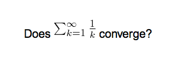

# Math and Symbols

<!-- toc -->

## MathJax

[MathJax](https://www.mathjax.org) is a modern, browser-based
typesetting system, useful for mathematical and chemical equations. It
does not require the installation of any extra software, so it is easy
to use, and it is recommended for most users.

MathJax is supported out of the box on Anki 2.1+, AnkiMobile, and
AnkiDroid 2.9+.

To try it out:

1. Type the following in a field:

       \sqrt{x}

2. Select the text you just typed.

3. Click the rightmost button in the editor, and choose "MathJax
   inline" from the menu. Anki will change the text so it reads:

       \(\sqrt{x}\)

4. If you click the Cards… button, you’ll see a preview of how the
   equation will appear when the card is reviewed.

Anki’s MathJax support expects content in TeX format. If you’re not
familiar with TeX formatting, please see [this cheatsheet](https://math.meta.stackexchange.com/questions/5020/mathjax-basic-tutorial-and-quick-reference).
Please note that point 2 does not apply in Anki - Anki uses `\(` and
`\)` for inline equations, and `\[` and `\]` for display equations.

If you want to use newlines in a MathJax expression, please use
<kbd>Shift</kbd>+<kbd>Enter</kbd> instead of just <kbd>Enter</kbd>, as a normal newline will prevent
MathJax from working correctly.

Anki includes built in support for mhchem for rendering chemical
equations. Please see the 'chemical equations' section and the following
sections for more information:
<https://mhchem.github.io/MathJax-mhchem/>

It is possible to [customize some settings](https://faqs.ankiweb.net/customizing-mathjax.html).

## LaTeX

LaTeX is a powerful typesetting system, useful for entering mathematical
formulas, chemical formulas, musical notation and so on. Anki provides
some support for LaTeX, allowing you to enter LaTeX code in your notes.
When you review a card, Anki will call LaTeX and display the generated
image instead.

LaTeX is more work to set up, and images can only be generated with the
computer version of Anki - though once generated, the images can be
displayed by mobile clients. Because of the extra complexity LaTeX
brings, it is only recommended for users that need more features than
MathJax provides.

### Assumed Knowledge

Anki’s LaTeX support is not turn-key: it is assumed that you know how to
use LaTeX already, and that you have it installed. If you have no
experience with LaTeX, please consult one of the many guides available
on the internet. If you are having trouble with markup, please ask on a
LaTeX forum.

To install LaTeX, on Windows use MiKTeX; on macOS use MacTeX, and on Linux
use your distro’s package manager. Dvipng must also be installed.

On Windows, go to Settings in MikTeX’s maintenance window, and make sure
"Install missing packages on the fly" is set to "Always", not to "Ask me
first". If you continue to have difficulties, one user reported that
running Anki as an administrator until all the packages were fetched
helped.

On macOS, LaTeX has only been tested with MacTeX and BasicTeX. If you use
BasicTeX, you need to install dvipng separately, with the following
command:

    sudo tlmgr update --self; sudo tlmgr install dvipng

The command may not be on the path, so you may need to provide the full
path, e.g /usr/local/texlive/2014basic/bin/x86_64-darwin/tlmgr.

If you are not using the above LaTeX packages, you will need to use the
[edit LaTeX](https://ankiweb.net/shared/info/937148547) add-on to specify
the full path to latex and dvipng.

### Web/Mobile

When you review a card with LaTeX on it, Anki will generate an image for
that LaTeX and place the image in your collection’s media folder for
future use. The web & mobile clients will display these images if they
already exist, but can not generate the images on their own.

To avoid having to review all your cards at least once before you can
study on the other clients, Anki can generate the images in bulk for
you. To generate all the images, please go to Tools&gt;Check Media.
After that, syncing should upload the generated media to AnkiWeb and the
other clients.

### Example

The most general way to input LaTeX content is to surround it with
\[latex\]\[/latex\] tags. There’s a shortcut button for this documented
in the [editor](editing.md) section.

\[latex\] tags must be used inside a field - placing them in the card
template will [cause problems](templates/fields.md).

For example, entering the following on the front of an Anki flashcard:

    Does [latex]\begin{math}\sum_{k = 1}^{\infty}\frac{1}{k}\end{math}[/latex] converge?

will produce this when the flashcard is viewed:

The formula in the example above is called a 'text formula', because it
is displayed right within the non-mathematical text. In contrast, the
following example shows a 'displayed formula':

    Does the sum below converge?

    [latex]\begin{displaymath}\sum_{k = 1}^{\infty}\frac{1}{k}\end{displaymath}[/latex]

'Text formulas' and 'display formulas' are the most common type of LaTeX
expressions, so Anki provides abbreviated versions of them. Expressions
of the form:

    [latex]\begin{math}...\end{math}[/latex]

can be shortened to

    [$]...[/$]

and expressions of the form

    [latex]\begin{displaymath}...\end{displaymath}[/latex]

can be shortened to

    [$$]...[/$$]

For example, the two LaTeX snippets shown before are equivalent to

    Does [$]\sum_{k = 1}^{\infty}\frac{1}{k}[/$] converge?

and

    Does the sum below converge?

    [$$]\sum_{k = 1}^{\infty}\frac{1}{k}[/$$]

respectively.

### Packages

Anki allows you to customize the LaTeX preamble so you can import custom
packages for chemistry, music and so on. For example, imagine you find
an example file for chemtex on the internet:

    \documentclass[a4paper,12pt]{report}
    \usepackage{chemtex}
    \begin{document}

    \initial
    \begin{figure}[h]\centering
    \parbox{.3\textwidth}{\ethene{H}{H$_3$C}{CH$_3$}{Br}}
    \hfil
    \parbox{.3\textwidth}{\cbranch{H}{S}{H}{S}{C}{S}{}{S}{H}
      \xi=-200 \cright{}{Q}{C}{D}{O}{S}{OH}}
    \hfil
    \parbox{.3\textwidth}{\hetisix{Q}{Q}{Q}{Q}{Q}{Q}{O}{Q}{O}
      \xi=-171 \fuseup{Q}{Q}{Q}{Q}{D}{Q}{D}{Q}{D}}
    \caption{Chemie mit {\tt CHEMTEX}\label{a1}}
    \end{figure}

    \end{document}

Firstly, follow the documentation of the package and MiKTeX/MacTeX in
order to install the package. To check the package is working, you’ll
want to put code like the above into a .latex file and test if you can
compile it from the command line. Once you’ve confirmed that the package
is available and working, we can integrate it with Anki.

To use the package with Anki, click "Add" in the main window, then click
the note type selection button. Click the "Manage" button, then select
the note type you plan to use and click "Options". The LaTeX header and
footer are shown. The header will look something like:

    \documentclass[12pt]{article}
    \special{papersize=3in,5in}
    \usepackage{amssymb,amsmath}
    \pagestyle{empty}
    \setlength{\parindent}{0in}
    \begin{document}

To use chemtex, you’d add the usepackage line in the earlier example, so
it looks like:

    \documentclass[12pt]{article}
    \special{papersize=3in,5in}
    \usepackage{amssymb,amsmath}
    \usepackage{chemtex}
    \pagestyle{empty}
    \setlength{\parindent}{0in}
    \begin{document}

After that, you should be able to include lines like the following in
your Anki cards:

    [latex]\ethene{H}{H$_3$C}{CH$_3$}{Br}[/latex]

### Template Conflicts

As of Anki 2.1.20 / AnkiMobile 2.0.56 / AnkiDroid 2.13, this workaround is no
longer required, as `{{field}}` text inside fields no longer causes problems. If
you need to support older versions and want to keep using this syntax, please
make sure you place the `{{=<% %>=}}` string at the very top of your front and
back template, as recent Anki versions will not recognize it anywhere but the
start.

For older versions:

It’s not uncommon for {{ and }} to pop up in LaTeX code when writing
mathematical equations. To ensure that your LaTeX equations don’t
conflict with Anki’s field replacements, it’s possible to change the
separator to something else.

For example, if you have a template:

    {{latex field}}

Changing it to the following will make it unlikely that the LaTeX will
conflict:

    {{=<% %>=}}
    <%latex field%>

### Cloze Conflicts

Cloze deletions are terminated with `}}`, which can conflict with a `}}`
appearing in your LaTeX. To prevent LaTeX from being interpreted as a closing
cloze marker, you can put a space between any double closing braces that do not
indicate the end of the cloze, so

    {{c1::[$]\frac{foo}{\frac{bar}{baz}}[/$] blah blah blah.}}

will not work, but

    {{c1::[$]\frac{foo}{\frac{bar}{baz} }[/$] blah blah blah.}}

will (and LaTeX ignores spaces in math mode, so your equation will
render the same). If you want to avoid adding the extra space into the
rendered text (for example, when you are making Cloze cards for learning
programming languages), another option is to use a HTML comment when
editing the card in HTML mode:

    {{c1::[$]\frac{foo}{\frac{bar}{baz}<!-- -->}[/$] blah blah blah.}}

You may use either workaround if you need to use the `::` character
sequence within the Cloze-deleted text. The first card generated for the
following note text will read `[type] in C++ is a type-safe union`:

    {{c1::std:<!-- -->:variant::~type~}} in C++ is a {{c2::type-safe union}}

### Unsafe Commands

Anki prohibits certain commands like \\input or \\def from being used on
cards or in templates, because allowing them could allow malicious
shared decks to damage your system. (To be on the safe side, these
commands are prohibited even in comments, so if you’re getting this
error but don’t think you’ve used one, please double-check any comments
you have in your headers, templates, and cards.) If you need to use
these commands, please add them to a system package and import that
package as described in the previous section.
