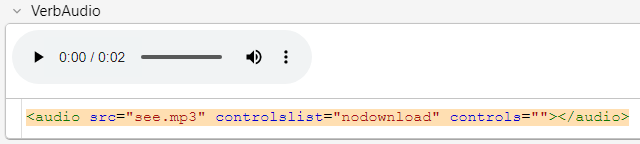
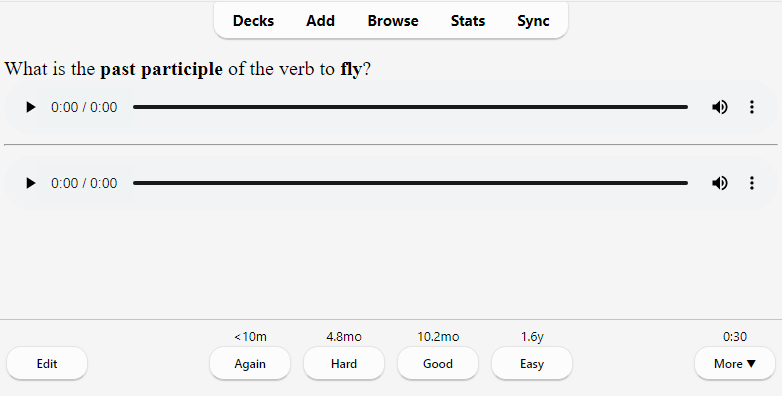

# Media

Anki stores the sounds and images used in your notes in a folder next to
the collection. For more on the folder location, please see the [file
locations](files.md) section. When you add media within Anki, either by
using the paperclip icon in the [editor](editing.md) or by pasting it into
a field, Anki will copy it from its original location into the media
folder. This makes it easy to back up your collection’s media or move it
to another computer.

If your media filenames contain spaces or other special characters such
as percentage signs, the way the filenames appear in the HTML editor will
differ from the way the filenames appear on disk. For example, a file called
`hello 100%.jpg` will appear as `hello%20100%25.jpg` in the HTML editor.
Internally, Anki still uses the original filenames, so if you would like to
[search](searching.md) for the file or modify the filename with [Find&Replace](browsing.md#find-and-replace), you will
need to use the name as it appears on disk, not as it appears in the
HTML editor. Exporting to a text file is another way to see the underlying
representation.

## Checking Media

You can use the Tools&gt;Check Media menu option to scan your notes and
media folder. It will generate a report of files in the media folder
that are not used by any notes, and media referenced in notes but
missing from your media folder. It does not scan question or answer
templates, which is why you can’t place media references to fields in
the template. If you need a static image or sound on every card, name it
with a leading \_ (e.g., `\_dog.jpg`) to tell Anki to ignore it when
checking for media. If you delete media using the unused media check,
Anki will move it into your operating system’s trash folder, so you can
recover if you accidentally delete media that shouldn’t have been
deleted.

## Manually Adding Media

When you add media via Anki's interface, Anki takes care of ensuring the
filenames are encoded in a way that should work across different devices,
removing characters that won't work on certain operating systems,
and truncating very long filenames.

If you manually add files to your [media folder](files.md#file-locations),
you should use Tools&gt;Check Media afterwards, to ensure the filenames are
encoded correctly. If you skip this step, any filenames that are not compatible
will be skipped when syncing.

## Supported Formats

Anki uses a program called mpv (and mplayer as a fallback) in order to support
sounds and videos. A wide variety of file formats are supported, but not all of
these formats will work on AnkiWeb and the mobile clients. MP3 audio and
MP4 video seems to be the most universally supported.

## Javascript and HTML5

Because Javascript is an advanced feature and so many things can go
wrong, **Javascript functionality is provided without any support or
warranty**. We can not offer any assistance with writing Javascript,
and we can not guarantee any code you have written will continue to work
without modification in future Anki updates. If you are not comfortable
addressing any issues you encounter, then please avoid using Javascript.
For other Javascript informations, see [template](templates/styling.md#Javascript).

For issues related to the Javascript features (`ankimedia` object) presented in this section,
please open an issue on https://github.com/evandrocoan/AnkiMediaQueue/issues.
The `ankimedia` object is light integration with Anki interface,
meaning its code does not depend on Anki internal working details.
Therefore, any issues you encounter with it are separate from Anki.
Instead, issues should probably be a problem with the third part `ankimedia` object
developed by a third party.

The `ankimedia` object was developed as an alternative to platform native audio players such as mpv or mplayer,
so you can use Anki embedded Javascript and HTML5 engine instead to play audio.
To do so, just replace `[sound:myfile.mp3]` by `<audio src="myfile.mp3" controlslist="nodownload" controls=""></audio>`
in your fields.
The audio will be able to play if the Javascript and HTML5 engine Anki uses support it.
Otherwise, you may try using the native mpv or mplayer with `[sound:myfile.mp3]` tag.
Next, there is an example of HTML5 media field using HTML editor:



The HTML5 audio will not be played automatically by default.
If you like to do so, you need to include the following script (Javascript) in your cards templates:
```html
<script type="text/javascript">
ankimedia.setup( { wait:0, delay:0.1, } );
ankimedia.addall( "front", 1.2 );  // use "back" instead of "front" if this is your back template
</script>
```
If you have HTML5 media in both your front and back cards,
you should include the `ankimedia` script in both of your templates,
setting the "front"/"back" value accordingly.

### Basic example:

Given the following fields:
* **Verb**: `see`
* **VerbAudio**: `<audio src="see.mp3" controlslist="nodownload" controls=""></audio>`
* **PastParticiple**: `seen`
* **PastParticipleAudio**: `<audio src="seen.mp3" controlslist="nodownload" controls=""></audio>`

**Front Template** card example:
```html
What is the <b>past participle</b> of the verb to <b>{{Verb}}</b>?

<span style="display: flex; align-items: center;">
    {{VerbAudio}}
</span>

<script type="text/javascript">
ankimedia.setup();
ankimedia.addall( "front", 1.2 );
</script>
```

**Back Template** card example:
```html
{{FrontSide}}
<hr id=answer>

<span style="display: flex; align-items: center;">
    {{PastParticipleAudio}}
</span>

<script type="text/javascript">
ankimedia.setup();
ankimedia.addall( "back", 1.2 );
</script>
```

**Style** card example:
```css
audio {
    width: 100%;
}
```

This should result in the **visual result** on Anki 2.1.56:



### Adding specific media

Instead of adding all media with `ankimedia.addall()`,
you could only add specific media with `ankimedia.add()`.
This is useful if you wish to play only some media or
want to play some in a different order.
This is an example:
```html
<script type="text/javascript">
ankimedia.setup();
ankimedia.add( `{{VerbAudio}}`, "front", 1.2 );
</script>
```
It will only add all the media found on the `{{VerbAudio}}` field,
even if there are other media on the full page.
To add multiple media from multiple fields, call it multiple times. For example:
```html
<script type="text/javascript">
ankimedia.setup();
ankimedia.add( `{{VerbAudio}}`, "front", 1.2 );
ankimedia.add( `{{PastParticipleAudio}}`, "front", 1.2 );
</script>
```
The media will immediately play once the question or answer is shown.
Media from the question will not play again on the answer
unless you pass `"front"` or `"back"` incorrectly.

Notice that we are adding the field using backtick's (`` ` ``)
instead of single or double quotes: `` `{{field_name}}` ``.
It is required to use backtick's because `{{field_name}}` may contain new lines,
and it would break the HTML structure if single or double quotes were used instead.
This would only cause a problem if backtick's were also found inside the `{{field_name}}`.
In this case, you could replace them with single or double quotes
or use single quotes as `ankimedia.add( '{{field_name}}' )` and inside `field_name`
do not use single quotes or new lines.

### Playback speed

By using the global function `setAnkiMedia()`, you can control the playback
speed of your HTML5 audio elements:
```typescript
/**
 * Find all audio and video tags and run them through the callback parameter.
 *
 * @param {Function} callback - to be called on each media.
 * @param {Array}    initial  - an additional list of items to be iterated over.
 */
function setAnkiMedia(callback, initial = undefined);
```

For example, this sets the attribute `media.dataset.speed`:
```html
<span style="display: flex; align-items: center;">
    <input type="button" value="x1.4" onclick="setAnkiMedia( media => { media.dataset.speed = 1.4; media.playbackRate = 1.4; } ); ankimedia.replay();" />
    <input type="button" value="x1.0" onclick="setAnkiMedia( media => { media.dataset.speed = 1.0; media.playbackRate = 1.0; } ); ankimedia.replay();" />
    <input type="button" value="x0.6" onclick="setAnkiMedia( media => { media.dataset.speed = 0.6; media.playbackRate = 0.6; } ); ankimedia.replay();" />
    {{VerbAudio}}
</span>
```
The `media.dataset.speed` is a special attribute `ankimedia` uses to control the playback speed.
It is not recommended to set only the HTML5 `media.playbackRate` attribute because it is superseded internally by `ankimedia`.
If you are experiencing problems with it,
you may try to set both `media.dataset.speed` and `media.playbackRate` attributes with `setAnkiMedia()`.
For more information about media attributes, consult de HTML5 media documentation:
[developer.mozilla#HTMLMediaElement](https://developer.mozilla.org/en-US/docs/Web/API/HTMLMediaElement).

You may also control the play speed individually on each media field HTML element,
by adding an HTML data attribute called `data-speed`. For example:
`<audio src="seen.mp3" data-speed="1.3" controlslist="nodownload" controls=""></audio>`.
`ankimedia` will automatically read it and play this audio using this speed.

### `ankimedia` object documentation

The `ankimedia` object support many unique configurations.
This requires you to know how to program on Javascript.
However, some arrangements may be simple enough for anyone to use.
```typescript
/**
 * Call this on your front-card before adding new media to the playing queue.
 * You can call this function as `setup({delay: 0.3, wait: false})`.
 *
 * @param {number} delay   - how many seconds to wait before playing the next audio (default 0.3).
 * @param {boolean} wait   - if true (default), wait for the question audio to play
 *        when the answer was showed before it had finished playing.
 * @param {function} extra - a function(media) to be run on each media of the page.
 * @param {array} medias   - an array of initial values to be passed to setAnkiMedia() calls.
 * @param {boolean} auto   - if true (default), auto-play the media elements.
 * @param {boolean} skip   - if true (default), it will skip playing the front media.
 */
ankimedia.setup(parameters: any = {});

/**
 * Return false if a media was paused and true if a media was started.
 */
ankimedia.togglePause();

/**
 * Re-play the media as done in the first time the card answer or question was shown.
 */
ankimedia.replay();

/**
 * Add an audio file to the playing queue and immediately starts playing.
 * If not playing already.
 *
 * @param {string} htmlfield - an audio filename or HTML text as string to find audios for playing.
 * @param {string} where    - pass "front" if this is being called on the card-front,
 *        otherwise, pass "back" as it is being called on the card-back.
 *        If not specified, each media element to be added automatically can also have a
 *        "data-where" attribute with the value "front" if this is being called on the
 *        card-front. Otherwise, the value "back" if it is being called on the card-back.
 * @param {number} speed    - the speed to play the audio, where 1.0 is the default speed.
 *        Each media element can also have an attribute as `data-speed="1.0"` indicating
 *        the speed it should play. The `data-speed` value has precedence over this parameter.
 */
ankimedia.add(filename, where = undefined, speed = undefined);

/**
 * Automatically add all media elements found and start playing them sequentially.
 *
 * @param {string} where - pass "front" if this is being called on the card-front,
 *        otherwise, pass "back" if it is being called on the card-back.
 *        If not specified, each media element to be added automatically can also have a
 *        "data-where" attribute with the value "front" if this is being called on the
 *        card-front, otherwise, the value "back" if it is being called on the card-back.
 * @param {number} speed - the speed to play the audio, where 1.0 is the default speed.
 *        Each media element can also have an attribute as `data-speed="1.0"` indicating
 *        the speed at it should play. The `data-speed` value has precedence over this parameter.
 */
ankimedia.addall(where = undefined, speed = undefined);
```
