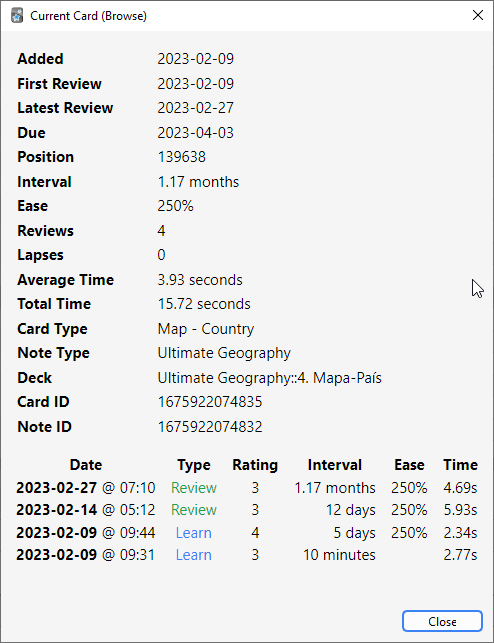

# Card Info, Graphs and Statistics

<!-- toc -->

## Card Info

You can display information about a card by using the Cards&gt;Info menu item,
by right-clicking on the card and then selecting **Info**, or by pressing
<kbd>I</kbd> on the study screen.

A few notes:

**Position**\
It shows the order the card will appear
in relative to other new cards. The position can be changed in the
browser. Once a card has been studied, the position is not used, unless
the card is manually reset to new again.

**Interval**\
The delay from one review to the next. Times are abbreviated; "0s, 1m,
3h, 4d, 5mo, 6y" refers to seconds, minutes, hours, days, months and
years respectively.

**Ease**\
The approximate amount the interval will grow when you answer a review
card with the "Good" button.

The bottom section shows the review history for the card. Rating denotes
the button (1 = Again, 4 = Easy). When cards are manually rescheduled using
the "reset" or "set due date" actions, the type will be listed as Manual
and the rating as 0.

## Statistics

The statistics window is accessed by clicking on **Stats** button at the
top of the main window, or by pressing <kbd>T</kbd>.

## Selecting Decks / Collection

### Deck

By default, the statistics window will show statistics from the currently selected deck and any
subdecks it may contain, but you can select any deck from your collection by typing its name in the
text box at the top of the screen or (from Anki 2.1.61), by using the deck selector at the bottom.

### Collection

If you select this checkbox, statistics will be shown for your entire collection. You can also display graphs
for arbitrary searches by adding filters in the search box at the top (2.1.28+).

### History

By default, Anki shows you statistics for the last 12 months.
You can change this to all history scope or deck life scope at the top. (The
"today" section at the top remains of course unaffected by this selection.)

### More

- Clicking on "Save PDF" at the bottom will save a PDF document of the statistics to a file
  on your desktop to make it easy to share your statistics with others.

- When you delete notes, their review history is maintained in Anki. It
  will not be included when looking at statistics for a specific deck (as
  Anki has no way of knowing which deck the deleted cards belonged to),
  but will be included when you look at statistics for the whole
  collection.

- Anki 2.1.28+ introduced redesigned graphs. The old graphs are still
  accessible with a <kbd>Shift</kbd>-click on the Stats button.

## Today

At the top of the statistics window is a brief list of textual
statistics about the reviews that you have completed today. A “review”
in this context is "one answering of a card", so a card might count as
multiple reviews if it needed to be seen multiple times, and a learning
card answered also counts as a “review.” A couple of the stats whose
meaning may not be immediately obvious:

### Again Count
This is the number of reviews that you have failed (i.e., pressed Again
on). The correct percentage listed afterwards is the number of cards you
did "not" fail divided by the total number of cards you studied.

### Learn, Review, Relearn, Filtered
The number of reviews that were learning cards, review cards, relearning
cards, or studied in a filtered deck when not due.

The stats for the current day are not a good overall indicator of your
learning progress; everyone has bad days and good days, and seeing that
you got a lower percentage correct on a particular day should not be
cause for concern. The remainder of the stats, which take longer periods
of time into account, will give more useful information if you wish to
try to change your study habits or scheduling settings based on your
performance.

The “today” statistics are unaffected by the time period selected at the
bottom of the window.

## The Graphs

### Future Due
This graph shows an estimated number of reviews that will be due on a
given day in the future if you learn no new cards and fail no cards. The
bars and the left axis show the number of cards due on each day if you
study all cards each day, while the gray shaded region and the right axis show
the number of cards due on that day if you don’t study at all until then.
Note that the forecast graph does not count reviews that are currently
overdue, so if you have a large backlog, the overdue cards will not be
displayed.

Daily load is an estimate of the average number of cards to be reviewed daily.
If you don't have a backlog, daily load should be approximately equal to
your number of due cards.

It is calculated as follows:

$$
\frac{1}{I_1} + \frac{1}{I_2} + \frac{1}{I_3} + \dots + \frac{1}{I_n}
$$

Here, \\(I_n\\) is the interval of
the n-th card. If the interval is less than one day, the summation term is 1. This
prevents cards with short intervals from unrealistically skewing the value of daily load.

Example: you have a card with an interval of 10 days and a card with an interval of 50 days.
Daily load = \\(\frac{1}{10} + \frac{1}{50} = 0.12\\), meaning that, _on average_, you will have 0.12 due cards per day.

### Calendar
This graph shows past card review activity. Hovering the mouse over a specific item
allows you to view the number of revisions made that day. Click on a day of the
week to make that the starting day.

### Reviews
This graph counts the number of card reviews you have done. The bars may
correspond to days, weeks, or months, depending on the time period
you’ve selected at the bottom of the screen. The differently colored
blocks show how many of the cards you answered on each day were
[mature](getting-started.md#card-states), young, relearning, or learning cards.
There is also a separate group for cards answered in a filtered/cram
deck while they were not due. The gray shaded region and the right axis show
the cumulative total for each type of review as time progresses across the
graph (so at 0 days, it would display the number for the entire time
period displayed on the graph).

### Card Counts
This pie chart shows what percentage of your deck or collection consists
of mature, unseen, young/learn, and suspended cards. If you wish to
calculate a more precise percentage, the key shows the exact number of
cards in each section, and the total number of cards is displayed to the
side.

### Review Time
This graph works exactly like Review Count, except that it deals with
the amount of time you spent on each card rather than the number of
cards answered.

### Review Intervals
This graph displays the number of cards that have a given interval (the
delay between two reviews). The gray shaded region and the right axis tell you
what percentage of your cards have an interval of less than or equal to the
time below that point. The time scope has a different effect on this
graph than other graphs: rather than changing which cards or period of
studying is included, it limits how far out the intervals are displayed
to (so 14-month intervals are not displayed at all on a 1-year graph).

### Card Ease
This graph shows the number of cards that have a specific ease factor.
Average ease of the selected deck / collection is also displayed here.

### Card Stability
Only shown if FSRS is enabled. Stability is defined as the amount of time required
for the probability of recall to decrease from 100% to 90%.

### Card Difficulty
Only shown if FSRS is enabled. Difficulty determines how quickly a card's interval grows
after each review.

### Card Retrievability
Only shown if FSRS is enabled. "Retrievability" is synonymous with "probability of recall".

Estimated total knowledge is the total number of cards you are likely to currently remember,
calculated by multiplying average retrievability by the number of cards that have been
reviewed at least once.

### Hourly Breakdown
This graph shows the percentage of total reviews you have passed during given
hours.
1. x-axis (bottom): Time of day (at given hour).
2. y-axis (right): Amount of cards studied.
3. secondary y-axis (left): Success rate in percent.

The blue bars thus show you the number of reviews you’ve made at that hour (so
that you know how significant the results are). The gray shaded region shows
the percentage of the total reviews you have passed (i.e., not pressed _Again_
on) at that hour.

### Answer Buttons
This graph shows how many times you’ve chosen the Again, Hard, Good, or
Easy button while studying learning/new, young, and
[mature](getting-started.md#card-states) cards. Anki also displays the percentage
of correct reviews for each type of card.

### True Retention Table

This table shows your retention across different cards and different time frames.
A card is defined as "mature" if its interval is ≥21 days. Only one review per day - the first one - counts.
Again counts as "Fail"; Hard, Good, and Easy count as "Pass".
This table can be used to check how well [Anki's spaced repetition algorithm](https://faqs.ankiweb.net/what-spaced-repetition-algorithm.html) is working for you.

If you are using FSRS, your true retention is expected to be close to your [desired retention](deck-options.md#desired-retention).
Please keep in mind that data for a single day is noisy, so it's better to look at monthly data. If your true retention doesn't match your desired retention very well, here are some general recommendations:

1) Optimize your FSRS parameters.
2) Use different presets with their own parameters for different material.
3) Suspend/reformulate [leeches](leeches.md).
4) Make sure you are [using the answer buttons as intended](studying.md#answer-buttons).

## Manual Analysis

If you’re interested in getting information from your statistics other
than what Anki provides, it is possible to access the data directly.
Because of the complexity involved, this is not something we can provide
any support for.

One option is to [write an add-on](addons.md) that adds another graph or
more details to the statistics window. There are several add-ons of this
sort on AnkiWeb already, which you can look at to get an idea of how it
works.

A more powerful and more complex option is to extract the review log
information directly from Anki’s database and analyze it in an external
program. Anki uses a database format called SQLite. There are many tools
available for working with SQLite databases; one of the easiest to start
with is called [SQLite Browser](http://sqlitebrowser.org/), which will
allow you to look around the database as well as export a CSV version of
tables for import into another program.

The most important table for statistics is the "revlog" table, which
stores an entry for each review that you conduct. The columns are as
follows:

**id**\
The time at which the review was conducted, as the number of
milliseconds that had passed since midnight UTC on January 1, 1970.
(This is sometimes known as "Unix epoch time", especially when in
straight seconds instead of milliseconds.)

**cid**\
The ID of the card that was reviewed. You can look up this value in the
id field of the "cards" table to get more information about the card,
although note that the card could have changed between when the revlog
entry was recorded and when you are looking it up. It is also the
millisecond timestamp of the card’s creation time.

**usn**\
This column is used to keep track of the sync state of reviews and
provides no useful information for analysis.

**ease**\
Which button you pressed at the end of the review (1 for Again, 4 for
Easy).

**ivl**\
The new interval that the card was pushed to after the review. Positive
values are in days; negative values are in seconds (for learning cards).

**lastIvl**\
The interval the card had before the review. Cards introduced for the
first time have a last interval equal to the Again delay.

**factor**\
The new ease factor of the card in permille (parts per thousand). If the
ease factor is 2500, the card’s interval will be multiplied by 2.5 the
next time you press Good.

**time**\
The amount of time (in milliseconds) you spent on the question and
answer sides of the card before selecting an ease button.

**type**\
This is 0 for learning cards, 1 for review cards, 2 for relearning cards,
and 3 for early "cram" cards (cards being studied in a filtered deck when they
are not due).
