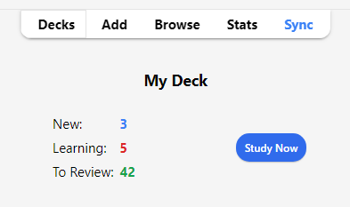
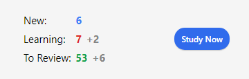

# Studying

<!-- toc -->

When you have found a deck you like or entered some notes in, it’s time
to start studying.

## Decks

Study in Anki is limited to the currently selected deck as well as any
subdecks it contains.

On the decks screen, your decks and subdecks will be displayed in a list. [New, Learn, and Due (To Review)](getting-started.md#card-states)
cards for that day will be also displayed here.

When you click on a deck, it will become the "current deck", and Anki
will change to the study screen. You can return to the deck list at any time by clicking on “Decks” at
the top of the main window. (You can also use the Study
Deck action in the menu to select a new deck from the keyboard, or you
can press the <kbd>S</kbd> key to study the currently selected deck.)

You can click the gears button to the right of a deck to rename or
delete the deck, change its [options](deck-options.md), or [export](exporting.md) it.

## Study Overview

After clicking on a deck to study, you’ll see a screen that shows you
how many cards are due today. This is called the "deck overview" screen:

The cards are split into [three types](getting-started.md#card-states): New, Learning, and To Review.
If you have [Bury siblings](#siblings-and-burying) activated in your deck options, you
may see how many cards will be buried in grey:

To start a study session, click the **Study Now** button. Anki will
proceed to show you cards until the cards to be shown for the day have
run out.

While studying, you can return to the overview by pressing the <kbd>S</kbd> key
on your keyboard.

## Questions

When a card is shown, only the question is shown at first. After
thinking about the answer, either click the **Show Answer** button, or
press the <kbd>Space</kbd>. The answer will then be shown. It’s okay if it takes
you a little while to recall the answer, but as a general rule if you
can’t answer within about 10 seconds, it’s probably better to move on
and show the answer than keep struggling to remember.

## Answer Buttons

After the answer is shown, compare the answer you thought of
with the answer that is shown and select any of the following buttons.

- **Again**: Select this when your answer is incorrect or when you couldn't recall the answer. If your answer is partially correct, you should be strict with yourself: if it counts as a fail in a real-life context outside of Anki, then it counts as a fail in Anki as well. You'll typically use this button about 5-20% of the time.

  Keyboard Shortcut: <kbd>1</kbd>

- **Hard**: Select this button when your answer is correct, but you had doubts about it or it took a long time to recall.

  Keyboard Shortcut: <kbd>2</kbd>

- **Good**: Select this when your answer is correct, but it took some mental effort to recall it. When Anki is used properly, this should be the most commonly used button. You'll typically use this button about 80-95% of the time.

  Keyboard Shortcut: <kbd>3</kbd>, <kbd>Space</kbd>, <kbd>Enter</kbd>

- **Easy**: Select this if your answer is correct and it took no mental effort to recall it.

  Keyboard Shortcut: <kbd>4</kbd>

If you find it hard to use four answer buttons, you can also use only **Again** and **Good** buttons. Use **Again** for incorrect answers and use **Good** for correct answers.

Each answer button shows the next time a card will be reviewed again if you select that button. To learn about the settings that control the next review intervals, see the topics [Learning Steps](deck-options.html#learning-steps), [Lapses](deck-options.md#lapses), [FSRS](deck-options.html#fsrs) and [Advanced](deck-options.md#advanced) in the Deck Options section.

## Fuzz Factor

When you select an answer button on a review card, Anki also applies a small amount of random “fuzz”
to prevent cards that were introduced at the same time and given the same ratings
from sticking together and always coming up for review on the same day.

Learning cards are also given up to 5 minutes of extra delay so that they
don’t always appear in the same order, but answer buttons won't reflect that. It
is not possible to turn this feature off.

## Editing and More

You can click the **Edit** button in the bottom left to edit the current
note. When you finish editing, you’ll be returned to study. The editing
screen works very similarly to the [add notes](editing.md) screen.

At the bottom right of the study screen is a button labeled **More**.
This button provides some other operations you can do on the current
card or note:

- [**Flag Card**](editing.md#using-flags): Adds a colored marker to the card, or toggles it off. Flags will appear during
  study, and you can search for flagged cards in the Browse screen. This is useful
  when you want to take some action on the card at a later date, such as looking
  up a word when you get home. If you're using Anki 2.1.45+, you can also rename flags
  from the [browser](browsing.md).

- **Bury Card / Note**: Hides a card or all of the note’s cards from review until the next day.
  (If you want to unbury cards before then, you can click the “unbury”
  button on the [deck overview](studying.md#study-overview) screen.) This is useful if
  you cannot answer the card at the moment or you want to come back to it
  another time. Burying can also [happen automatically](studying.md#siblings-and-burying) for
  cards of the same note.

- **Reset card**: Moves the current card to [the end of the new queue](browsing.md#cards).

  The "Restore original position" option allows you to reset the card back to its original position when you reset it.

  The "Reset repetition and lapse count" option, if enabled, will set the review and failure counters
  for the card back to zero. It does not remove the review history that is shown at the bottom of the
  card info screen.

- **Set Due Date**: Puts cards in the review queue, and [makes them due on a certain date.](browsing.md#cards)

- **Suspend Card / Note**: Hides a card or all of the note’s cards from review until they are
  manually unsuspended (by clicking the suspend button in the browser).
  This is useful if you want to avoid reviewing the note for some time,
  but don’t want to delete it.

- **Options**: Edit the [options](deck-options.md) for the current deck.

- **Card Info**: Displays [statistical information](stats.md#card-info) about the card.

- **Previous Card Info**: Displays [statistical information](stats.md#card-info) about the previous card.

- [**Mark Note**](editing.md#the-marked-tag): Adds a “marked” tag to the current note, so it can be easily found in the
  browser. This is similar to flagging individual cards, but works with a tag
  instead, so if the note has multiple cards, all cards will appear in a search
  for the marked tag. Most users will want to use flags instead.

- **Create Copy**: Opens a [duplicate](browsing.md#finding-duplicates) of the current
  note in the editor, which can be slightly modified to easily obtain variations of your cards.
  By default, the duplicate card will be created in the same deck as the original.

- **Delete Note**: Deletes the note and all of its cards.

- **Replay Audio**: If the card has audio on the front or back, play it again.

- **Pause Audio**: Pauses the audio if it is playing.

- **Audio -5s / +5s**: Jump backwards / forward 5 seconds in the currently playing audio.

- **Record Own Voice**: Record from your microphone for the purposes of checking your
  pronunciation. This recording is temporary and will go away when you
  move to the next card. If you want to add audio to a card permanently,
  you can do that in the edit window.

- **Replay Own Voice**: Replay the previous recording of your voice (presumably after showing
  the answer).

## Display Order

Studying will show cards from the selected deck and any decks it
contains. Thus, if you select your “French” deck, the subdecks
“French::Vocab” and “French::My Textbook::Lesson 1” will be shown as
well.

By default, for new cards, Anki gathers cards from the decks in
alphabetical order. So in the above example, you would get cards first
from “French”, then “My Textbook”, and finally “Vocab”. You can use this
to control the order cards appear in, placing high priority cards in
decks that appear higher in the list. When computers sort text
alphabetically, the “-” character comes before alphabetical characters,
and “\~” comes after them. So you could call the deck “-Vocab” to make
them appear first, and you could call the other deck “\~My Textbook” to
force it to appear after everything else.

New cards and reviews are gathered separately, and Anki won’t wait until
both queues are empty before moving on to the next deck, so it’s
possible you’ll be exposed to new cards from one deck while seeing
reviews from another deck, or vice versa. If you don’t want this, click
directly on the deck you want to study instead of one of the parent
decks.

Since cards in learning are somewhat time-critical, they are fetched
from all decks at once and shown in the order they are due.

To control the order cards appear in, see [Display Order](./deck-options.md#display-order). For more fine-grained ordering of new cards, you
can change the order in the [browser](browsing.md).

## Siblings and Burying

Recall from [the basics](getting-started.md) that Anki can create more than one
card for each thing you input, such as a front→back card and a
back→front card, or two different cloze deletions from the same text.
These related cards are called "siblings".

When you answer a card that has siblings, Anki can prevent the card’s
siblings from being shown in the same session by automatically "burying"
them. Buried cards are hidden from review until the clock rolls over to
a new day or you manually unbury them using the “Unbury” button that’s
visible at the bottom of the [deck overview](studying.md#study-overview) screen. Anki
will bury siblings even if the siblings are not in the same deck (for
instance, if you use the [deck override](templates/intro.md) feature).

You can enable burying from the [deck options](deck-options.md) screen -
there are separate settings for new cards and reviews.

Anki will only bury siblings that are new or review cards. It will not
hide cards in learning, as time is of the essence for those cards. On
the other hand, when you study a learning card, any new/review siblings
will be buried.

Also note that a card cannot be buried and suspended at the same time. Suspending a
buried card will unbury it. Suspended cards can't be buried.

## Keyboard Shortcuts

Most of the common operations in Anki have keyboard shortcuts. Most of
them are discoverable in the interface: menu items list their shortcuts
next to them, and hovering the mouse cursor over a button will generally
show its shortcut in a tooltip.

When studying, either <kbd>Space</kbd> or <kbd>Enter</kbd> will show the answer. When the
answer is shown, you can use <kbd>Space</kbd> or <kbd>Enter</kbd> to select the Good button.
You can use the <kbd>1</kbd>-<kbd>4</kbd> keys to select a specific ease button. Many people
find it convenient to answer most cards with <kbd>Space</kbd> and keep one finger
on <kbd>1</kbd> for when they forget.

The "Study Deck" item in the Tools menu allows you to quickly switch to
a deck with the keyboard. You can trigger it with the <kbd>/</kbd> key. When
opened, it will display all of your decks and show a filter area at the
top. As you type characters, Anki will display only decks matching the
characters you type. You can add a space to separate multiple search
terms, and Anki will show only decks that match all the terms. So “ja 1”
or “on1 ja” would both match a deck called “Japanese::Lesson1”.

## Falling Behind

When you fall behind in your reviews, Anki by default prioritizes cards that have
been waiting the longest. This ordering ensures that no cards will
be left waiting indefinitely, but it means that if you introduce new
cards, their reviews won’t appear until you’ve gotten through your
backlog.

When you answer cards that have been waiting for a while, Anki factors
in that delay when determining the next time a card should be shown. This means if you are returning to Anki after a long break, you don't have to start anew and can just start back from where you left.
